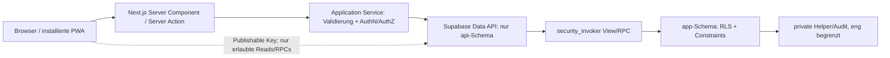

# Implementation Plan: Vollständiger Neubau von A-KlassenHoiz

**Branch**: `001-rebuild-a-klassenhoiz` | **Date**: 2026-07-13 | **Spec**: [`spec.md`](./spec.md)  
**Input**: Feature specification from `/specs/001-rebuild-a-klassenhoiz/spec.md`  
**Product Source**: [`../../docs/PRD.md`](../../docs/PRD.md) als einziger kanonischer PRD-Pfad  
**Planstatus**: Technischer Plan vollständig; keine Implementierung, kein Deployment und keine Supabase-Mutation ausgeführt  
**Taskstatus**: Die vorhandene `tasks.md` stammt aus dem Stand vor den A1–A10-Korrekturen, ist nicht
implementierungsreif und MUSS erst nach erneuter Analyse separat regeneriert werden.

## Summary

A-KlassenHoiz V2 wird als vollständige Greenfield-Anwendung im neuen Repository `Daniel-Braun123/A-KlassenHoizV2` gebaut: eine mobile-first, WCAG-2.2-AA-konforme und installierbare Next.js-PWA mit zentral verwalteten Liga-Saisons, privaten Tipprunden, genau einem Owner, serverseitigen Einzelspiel-Fristen und kanonischer 4/3/2/0-Wertung.

Die App verwendet Next.js App Router/React Server Components, eine strikt typisierte Application-Service-Schicht und Supabase Auth/Postgres/Storage. Nur ein schmales `api`-Schema wird exponiert; neue Domänentabellen liegen im nicht exponierten `app`-Schema und sind trotzdem vollständig durch RLS und Minimal-Grants abgesichert. Kritische Mutationen laufen atomar in DB-RPCs mit Datenbankzeit. App-Admins verwalten ausschließlich globale Wettbewerbsdaten; ein zeitlich begrenzter Break-Glass-Pfad liest nur freigegebene Support-Metadaten und legt weder Vorfristtipps noch E-Mail-Adressen offen. Die Testpyramide kombiniert Vitest/RTL, pgTAP und einen lokalen Supabase-Neuaufbau, vollständige RLS-Matrizen, Playwright über drei Engines/mobile Projekte, Axe, reproduzierbare Performance-Labore und reale PWA-/Accessibility-Abnahmen. V1 erhebt weder Produktanalytics noch Real-User-Monitoring.

Das bestehende Supabase-Projekt wird erst nach einer separat und ausdrücklich freigegebenen, gesicherten Altbestandslöschung mit ausschließlich neuen Migrationen wiederverwendet. Das bestehende Vercel-Projekt wird später kontrolliert mit dem neuen Repository verbunden; Produktion wird erst nach geschützter Preview-Abnahme umgeschaltet.

## Planungsbasis und Abgleich A1–A10

Bei Konflikten gilt die Reihenfolge Projektverfassung 2.0.0 → `docs/PRD.md` 1.1 → `spec.md`.
`docs/PRD.md` ist der einzige kanonische PRD-Pfad; alle weiteren Dateien dieses Features sind
abgeleitete Planungsartefakte.

| Entscheidung | Verbindliche Umsetzung im Plan |
|---|---|
| A1 – Source of Truth | Ausschließlich `docs/PRD.md`; keine konkurrierende PRD und keine Alt-Spezifikation als Eingabe |
| A2 – App-Adminrechte | Ausschließlich globale Wettbewerbsverwaltung; keinerlei reguläre Privatrundenrechte; Break-Glass nur kurzlebig, begründet, read-only, allowlistbasiert und vollständig auditiert, ohne Vorfristtipps oder E-Mail-Adressen |
| A3 – endgültige Rundlöschung | W5 plant den sofortigen atomaren Hard Delete nach exakter Namenseingabe, ohne Wiederherstellungsfrist und mit minimalem PII-freiem Audit außerhalb des Löschverbunds |
| A4 – Usability | W9 und der Qualitätsvertrag verlangen mindestens fünf ungeschulte repräsentative Personen, iOS-/Android-Mix plus Desktop, keine Bedienhilfe, dokumentierte Messgrenzen, 5/5- und 4/5-Gates sowie Medianbewertung |
| A5/A6 – Performance/Analytics | Keine Produktanalytics, kein RUM und kein p75-Feldgate; ausschließlich das reproduzierbare Lighthouse-Mobile-Laborgate mit 90/2,5 s/0,1/200 ms |
| A7 – Break-Glass | Ausschließlich querschnittlich in W8 Security/Operations; US2 beziehungsweise W4 bleibt unabhängig abnehmbar |
| A8 – Rechtliches | Projekteigentümer klassifiziert V1 verbindlich als private, nicht-kommerzielle, einladungsbasierte Freunde-Website: kein Impressum und keine private Anschrift-/Steuerangaben; W0A prüft stattdessen den wahrheitsgemäßen Nutzungs-/Datenschutzhinweis und verlangt vor Öffnung oder Monetarisierung eine neue rechtliche Prüfung |
| A9 – Produktionsmutationen | W11 trennt Provisionierung, synthetische Datenanlage, Produktionstest, Löschung und Bereinigungsverifikation in fünf einzeln freizugebende Schritte |
| A10 – Prozess | Die damalige Korrekturrunde blieb dokumentations-only. Der spätere Implementierungslauf darf Remote-Mutationen weiterhin nur über die je Aufgabe verlangten Einzelgates ausführen; die Freigabe vom 13. Juli 2026 gilt ausschließlich für die Altbestandslöschung ohne Backup, nicht für V2-Rollout oder Vercel. |

## Technical Context

**Language/Version**: Node.js 24.18.0 LTS mit npm 11.18.0; TypeScript 6.0.3 mit `strict: true`; SQL/PLpgSQL auf PostgreSQL 17  
**Primary Dependencies**: Next.js 16.2.10, React/React DOM 19.2.7, `@supabase/supabase-js` 2.110.2, `@supabase/ssr` 0.12.0, Zod 4.4.3, Tailwind CSS 4.3.2 plus CSS Custom Properties, `qrcode` 1.5.4; eigener kleiner Service Worker; vollständige exakte Toolchain in `research.md`  
**Storage**: bestehendes, seit T274 bestätigt leeres Supabase-Projekt `ewqzhdnfoozjzenzmtlm`; PostgreSQL im neuen `app`/`private`/`api`-Schema erst nach Freigabe B; Supabase Auth; öffentlicher, adminbeschreibbarer `club-logos`-Bucket
**Testing**: Vitest 4.1.10, React Testing Library 16.3.2, jsdom 29.1.1, Supabase CLI 2.109.1/local Postgres, pgTAP, DB-Lint, Playwright 1.61.1, `@axe-core/playwright` 4.12.1, manuelle WCAG-/Real-Device-PWA-Matrix  
**Target Platform**: moderne Browser auf Smartphone ab 320/375 px, Tablet und Desktop; installierte PWA auf Android Chrome, Desktop Chromium und iOS Safari; Vercel Node runtime in `eu-central`-naher Region soweit im Bestandsprojekt konfigurierbar  
**Project Type**: einzelne Full-Stack-Webanwendung/PWA mit verwaltetem Supabase-Backend  
**Performance Goals**: reproduzierbares Lighthouse-Mobile-Labor im Production Build mit Median aus drei kalten, isolierten Läufen: Performance ≥ 90, LCP ≤ 2,5 s, CLS ≤ 0,1, TBT ≤ 200 ms; keine p75-Feldwert-Grenze; serverbestätigter Tipp-Autosave vermittelt unter normaler Verbindung binnen 1 s ehrlichen Status; Ranglisten für erwartete V1-Größe ohne Volltabellenscan über fremde Runden  
**Constraints**: WCAG 2.2 AA; 44×44-CSS-px-Touchziele; keine Offline-Tippqueue; kein RUM und keine Produktanalytics in V1; DB-Zeit ist Deadline-Autorität; RLS auf allen Domänentabellen; keine Secret Keys im Browser; keine Alt-Migration/-Code/-Datenübernahme; keine Co-Admins; keine Wett-/Echtgeldbegriffe  
**Scale/Scope**: V1 für Betreiber, Freunde und mehrere private Gruppen; 7 priorisierte Nutzerreisen, etwa 17 Domänen-/Sicherheits- und Audit-Tabellen, zentrale Daten von vielen Runden gemeinsam genutzt; Architektur ohne unnötige verteilte Systeme, aber mit indizierter rundenbezogener Skalierung

## Constitution Check

*GATE vor Phase 0: PASS. Re-check nach Phase 1: PASS.*

| Gate | Planerfüllung | Status |
|---|---|---|
| Kanonische Eingaben | Verfassung 2.0.0, einziges PRD `docs/PRD.md` 1.1 und aktuelle `spec.md`; keine konkurrierende Produktquelle | PASS |
| Mobile-first PWA und Accessibility | 320/375-px-Basis, vierteilige mobile Navigation, Manifest/SW/Offline/Update, Axe plus manuelle WCAG-2.2-AA-/Real-Device-Matrix | PASS |
| Designsystem | DTCG-artige Foundation-/Semantic-/Component-Tokens, native Primitives, vollständige Interaktionszustände, kontrastgeprüfter grüner Seed | PASS |
| Datenschutz und Rundenisolation | nicht durchsuchbare Runden, minimale PII, keine E-Mail-Spiegelung, per-Runde Anonymisierung, keine privaten SW-Caches; Break-Glass nur zeitlich begrenzt für lesende Support-Metadaten | PASS |
| Autorisierung und RLS | Server Actions prüfen AuthN/AuthZ; schmales `api`-Schema; RLS/Grants auf allen Domänentabellen; App-Admin-Deny für private Mutationen, Vorfristtipps und E-Mail; vollständige Positiv-/Negativmatrix | PASS |
| Serverhoheit | `clock_timestamp()` innerhalb gesperrter DB-Transaktion bestimmt Tippfrist/Sichtbarkeit; Clientzeit irrelevant | PASS |
| Deterministische Regeln | eine kanonische reine immutable DB-Funktion, atomare Recalc, Revisionen, abgeleitete Rankings und Rebuild-Nachweis | PASS |
| Rollen und zentrale Daten | genau eine Owner-Mitgliedschaft mit DB-Invarianten; kein Co-Admin; globale App-Admins pflegen ausschließlich Liga-Saisons/Spielplan/Ergebnis und erhalten keine privaten Rundenrechte | PASS |
| Endgültige Rundlöschung | reversible Archivierung als Standard; irreversibler transaktionaler Hard Delete nach Namensbestätigung, globale Daten/Konten bleiben, minimales PII-freies Audit | PASS |
| Produktgrenze | keine öffentlichen Runden, Echtgeld-, Quoten-, Gewinn- oder Glücksspielmechaniken; keine V1-Nichtziele eingeschleust | PASS |
| Clean Room / Strict TS | neues Repository, neues Schema und frische Migrationen; kein `db pull` als Baseline; Strict TS ohne ungeprüfte Suppressions | PASS |
| Testnachweis | Unit, Component, Integration/Contract, pgTAP/RLS/Storage, E2E, A11y, PWA, Security, verbindliches Fünf-Personen-Usability-Protokoll und reproduzierbares Performance-Labor | PASS |
| V1-Beobachtung und privater Hinweis | keine Analytics/RUM/p75-Feldgrenze; kein Impressum oder private Anschrift-/Steuerangaben; wahrheitsgemäßer Nutzungs-/Datenschutzhinweis, neue Prüfung vor Öffnung/Monetarisierung | PASS |
| Betriebssicherheit | Reset, neue Remote-Migrationen, privilegierte Identität, synthetische Produktionsdaten, Produktionstest, Bereinigung, Vercel-Git-Link und Cutover sind getrennte explizite Freigabegates | PASS |

Die einmalige Löschung des Altbestands ohne Sicherung verletzte die Sicherungs-/Rollbackpflicht aus
Arbeitsablauf und Qualitätsgates Nr. 6. Der Projekteigentümer genehmigte diese eng begrenzte
Ausnahme am 13. Juli 2026 ausdrücklich und akzeptierte den irreversiblen Verlust. Sie galt nur für
Projekt `ewqzhdnfoozjzenzmtlm` und ist nach der bestandenen Nachkontrolle T274 ausgelaufen;
Genehmigung und Ersatzkontrollen stehen in `docs/operations/approvals/supabase-reset-a.md`.
Datenschutz-, Sicherheits-, Clean-Room- und übrige Governance-Prinzipien bleiben unverändert
verbindlich.

## Skills & MCPs

### Selected skills

| Skill | Purpose |
|---|---|
| `specify-capability-orchestrator` | Fähigkeiten auswählen, Capability Record führen und Planungsartefakte/Gates koordinieren |
| `speckit-constitution` | Verfassung für eingeschränkte App-Adminrechte und explizite Produktionsmutationen konsistent aktualisieren |
| `speckit-specify` | Verbindliche Produktentscheidungen und messbare Abnahmen in der bestehenden Spezifikation nachführen |
| `speckit-plan` | Phase-0-/Phase-1-Planungsworkflow und Artefakte erzeugen, ohne zu implementieren |
| `speckit-tasks` | Abhängigkeitsgeordnete, storybasierte und sicher ausführbare Implementierungs-/Testaufgaben erzeugen |
| `speckit-implement` | Aufgaben strikt phasen- und gategeordnet umsetzen, lokal verifizieren und erledigte Checkboxen nachführen |
| `supabase:supabase` | Auth-, Data-API-, RLS-, Storage- und sicherer Reset-/Wiederverwendungsplan |
| `supabase:supabase-postgres-best-practices` | Schema-, Index-, Constraint-, Transaktions-, RLS- und Queryentscheidungen prüfen |
| `vercel-react-best-practices` | Server-first React/Next.js, kleine Client-Grenzen, Parallelität, Bundle- und Renderingstrategie |
| `impeccable` | mobile UX, semantisches Designsystem, vollständige Zustände und Accessibility-Qualitätsbar |
| `playwright-cli` | Cross-Browser-/Mobile-/PWA-/Accessibility-E2E-Strategie und stabile CI-Ausführung |
| `systematic-debugging` | Reproduzierbare Konfigurationsfehler ursächlich isolieren und mit minimalen Änderungen beheben |

### Selected tools and connectors

| Tool or connector | Purpose | Status |
|---|---|---|
| Lokales Git/Dateisystem | Repository/Branch/Dateien prüfen, kanonischen PRD-Pfad herstellen; später lokale Qualitätskommandos | Available |
| `apply_patch` | PRD, Verfassung, Spezifikation, Plan und abhängige Designartefakte konsistent aktualisieren | Available |
| Supabase Connector/MCP | Organisation, Kosten und Ziele prüfen; das isolierte Free-Preview-Projekt anlegen und Schema/RLS/Advisors verifizieren; Production ausschließlich read-only nachkontrollieren | Used / T263 complete; Production unchanged |
| Supabase CLI 2.109.1 | Preview-Projekt im isolierten Arbeitsverzeichnis verknüpfen, exakt 51 V2-Migrationen migrations-only anwenden, API/Auth-Basiskonfiguration setzen und Migrationsgleichstand prüfen | Used / T263 Preview only; no Production mutation |
| Offizielle Web-/Dokumentationssuche | Node-Archiv/Prüfsumme sowie aktuelle Supabase-Changelog-, Auth- und Autoconfirm-Semantik verifizieren | Used |
| In-app Browser | Foundation-Shell bei 320×800, 390×844 und 1440×900 auf Reflow, Touchziele, Typografie und Browserfehler prüfen | Used locally; no remote mutation |
| GitHub Repository über `origin` | neues Repo `Daniel-Braun123/A-KlassenHoizV2` als Quellbasis bestätigen | Available |
| Vercel Connector/CLI | Lokalen OIDC-Projektbezug ohne Token-Ausgabe prüfen; Token ist abgelaufen, Live-Verifikation bleibt separate Deployment-Aufgabe | Unavailable / expired local OIDC |

Capability-Einfluss: Die Supabase-Fähigkeiten führten zur `api`/`app`/`private`-Grenze, DB-Zeit/RPC-Transaktionen und vollständigen Grant-/RLS-Matrix. Die React-, Design- und Playwright-Fähigkeiten führten zu Server-first Rendering, kleinen Client-Grenzen, tokenisierten Zuständen, 44-px-Zielen sowie der kombinierten automatischen/manuellen Cross-Browser-, A11y- und PWA-Abnahme. Der Implementierungslauf ergänzte eine gepinnte Greenfield-Baseline, projektlokales Node 24.18.0/npm 11.18.0, lokale Remote-Sperren und CI-Gates. Die Foundation-Shell wurde im lokalen Browser bei 320, 390 und 1440 CSS-Pixeln ohne horizontalen Überlauf oder Browserfehler geprüft; die 44-px-Ziele und mobile/desktop Typografie waren wirksam. Connector und CLI bestätigten read-only das alte Supabase-Ziel und lieferten die exakte Lösch-/Schutzinventur; `systematic-debugging` isolierte die lokale PowerShell-Argumentweitergabe sowie zwei transaktional zurückgerollte Objektabhängigkeiten. Die endgültige allowlistbasierte CLI-Transaktion und die unabhängige Nachkontrolle entfernten den Altbestand vollständig, während Projekt und Plattformschemas gesund blieben. Die neue lokale DB-Foundation ist als Quellstand vorhanden, kann ohne Docker-kompatible Engine jedoch noch nicht durch Reset, Lint und pgTAP ausgeführt werden; T024, T040 und T041 bleiben deshalb offen. Vercel-, GitHub- und V2-Rollout-Mutationen bleiben gesperrt.

## Project Structure

### Documentation (this feature)

```text
specs/001-rebuild-a-klassenhoiz/
├── plan.md
├── research.md
├── data-model.md
├── quickstart.md
├── contracts/
│   ├── application-actions.md
│   ├── quality-contract.md
│   └── rls-access-matrix.md
└── tasks.md                     # durch /speckit-tasks erzeugt
```

### Source Code (repository root)

```text
app/
├── (public)/                    # Start, Auth, Einladungsvorschau, Rechtstexte
├── (authenticated)/
│   ├── rounds/[roundId]/        # Übersicht, Tippen, Rangliste, Ergebnisse, Settings
│   └── profile/                 # Profil, Rundenwechsel, Konto/Datenschutz
├── admin/                       # globale Liga-/Spielplan-/Ergebnisverwaltung
├── auth/callback/               # Auth-Callback Route Handler
├── manifest.ts                  # PWA-Manifest
└── offline/                     # öffentliche Offline-Fallbackroute

components/
├── ui/                          # zugängliche Primitives, keine Fachlogik
├── patterns/                    # PageHeader, Status, Empty/Error, Confirm, Navigation
├── auth/
├── competition/
├── rounds/
├── predictions/
└── rankings/

features/
├── auth/
├── competition/
├── rounds/
├── invitations/
├── predictions/
├── scoring/
├── rankings/
├── privacy/
└── support/
    ├── actions.ts               # Server Actions: dünne Adapter
    ├── service.ts               # server-only Application Service
    ├── schemas.ts               # Zod Input/Output
    └── types.ts                 # minimale DTOs

lib/
├── supabase/                    # Browser-/Server-Client, Proxy-Unterstützung
├── auth/                        # Session-/Authorization-Guards
├── design/                      # Token-/Theme-Helfer
├── observability/               # redigierte technische Events
└── validation/

styles/
├── tokens.css                   # Foundation → semantic → component tokens
├── globals.css
└── utilities.css

public/
├── icons/                       # PWA/Maskable/Apple Icons
├── sw.js                        # kleiner first-party Service Worker
└── offline-assets/              # ausschließlich öffentliche, versionierte Assets

supabase/
├── config.toml                  # lokal; Data API exponiert nur api
├── migrations/                  # ausschließlich neue V2-Migrationen
├── seed.sql                     # nur synthetische lokale Daten
└── tests/
    ├── database/                # pgTAP Schema/Funktionen/Constraints
    ├── rls/                     # Actor-/Zeit-/Cross-Round-Matrix
    └── storage/                 # club-logos Policies

tests/
├── unit/
├── component/
├── integration/
├── e2e/
├── pwa/
├── accessibility/
└── fixtures/                    # ausschließlich synthetische deterministische Daten

scripts/
├── verify-local-target.*        # blockiert versehentliche Remote-DB-Kommandos
├── provision-app-admin.*        # kontrolliert, auditiert, nicht aus UI
└── operations/                  # Reset-/Forward-Recovery-Runbook, nie CI-automatisch

.github/workflows/
├── quality.yml
├── database.yml
├── e2e.yml
└── release-gates.yml
```

**Structure Decision**: Ein einzelnes Next.js-Projekt ist ausreichend; Supabase liefert das verwaltete Backend. Fachmodule liegen vertikal unter `features/`, während `components/ui` nur fachneutrale Primitives enthält. Server Actions bleiben dünn und delegieren an `server-only` Services. SQL und RLS leben ausschließlich in der frischen V2-Migrationshistorie. Ein Monorepo, separates eigenes API-Service und alte Quellordner sind nicht vorgesehen.

## Architecture

### Request- und Trust-Grenzen



Der Browser ist nicht vertrauenswürdig. Next.js prüft früh und minimiert Rückgaben; Supabase Grants/RLS/Constraints erzwingen dieselbe Grenze unabhängig davon. Secret/Service Role ist kein normaler Requestpfad.

### Read-/Write-Modell

- Reads: Server Components → Application Service → `api`-Views/RPCs. Öffentliche Einladungsvorschau ist tokengebunden und minimal.
- Writes: Client-Interaktion → Server Action → Zod → Session/Profile/Objektrecht → kanonische RPC → Transaktion/RLS/Constraint → minimales Action Result.
- Caching: private Daten standardmäßig dynamisch/no-store oder nutzergebunden; explizite Tags nur für globale veröffentlichte Stammdaten. Mutationen invalidieren engste Tags.
- Realtime ist in V1 nicht erforderlich. Konsistenz entsteht durch Serverbestätigung und gezielte Refreshes; keine zusätzliche Subscription-Komplexität.

### Zentrale Liga-Saison

Liga, Saison, Liga-Saison, Vereine, Zuordnung, Spieltage, Spiele und Ergebnisse werden genau einmal global verwaltet. Jede Runde referenziert genau eine veröffentlichte Liga-Saison. Spielplan-/Ergebnisänderungen wirken über gemeinsame IDs auf alle Runden; Tipps/Wertungen bleiben rundenbezogen. Nach dem ersten Tipp ist ein Liga-Saison-Wechsel der Runde gesperrt.

### Autorisierung

- `app_admin` ist eine globale DB-Rolle im Profil, mehrfach möglich, aber nur außerhalb der App provisionierbar.
- `owner`/`member` sind die einzigen Rundenrollen. Ownerrechte gelten genau für eine Runde; Besitzer dürfen keine globalen Daten ändern.
- App-Admin ist kein Supermitglied privater Runden und darf sie weder bearbeiten noch Mitglieder,
  Einladungen oder Tipps verändern. Break-Glass ist fall- und rundenbezogen, zeitlich begrenzt und
  read-only; es liefert nur freigegebene Support-Metadaten. Vorfristtipps und E-Mail-Adressen sind
  auch dann technisch ausgeschlossen.
- Alle Deadline- und Fremdtippentscheidungen verwenden DB-Zeit je Spiel.

### Datenintegrität und Parallelität

- Unique-/Check-/FK-/deferred Constraint-Trigger sichern Liga-Saison-, Owner-, Nickname-, Tipp- und Ergebnisinvarianten.
- Match-/Result-Row Locks serialisieren Anstoßänderung/Tipp-Speichern und Ergebnis/Neuberechnung.
- Idempotenzschlüssel plus natürliche Unique Constraints machen Create/Join/Autosave wiederholbar.
- Optimistic Versions verhindern stilles Überschreiben paralleler Adminänderungen.
- Ranglisten sind abgeleitete Read Models; keine zweite mutable Gesamtpunktquelle.

## Requirements Traceability

| Spezifikationsbereich | Architektur-/Implementierungsort | Verbindlicher Nachweis |
|---|---|---|
| FR-001–FR-007 Konto/Sitzung | W3, `features/auth`, Supabase SSR/Auth | Auth-Integration, Enumeration-Negativtests, Playwright Register/Login/Reset/Redirect |
| FR-008–FR-019 globale Wettbewerbe | W2/W4, zentrale `app`-Entitäten und Admin-RPCs | Constraints, App-Admin-Allow/User-Deny, zwei Runden teilen einen Spielplan, Korrekturpfad |
| FR-020–FR-035 Runden/Owner/Einladung | W5, Owner-Constraints, hashbasierte Einladung | pgTAP Parallelität/Invarianten, Join-E2E via Link/QR, keine Co-Admin-Repräsentation |
| FR-036–FR-045 Tippabgabe/Sichtbarkeit | W1/W6, Autosave-State-Machine, DB-Frist-RPC | Mobile Task Test, vor/exakt/nach Anpfiff, Offline/Retry, Cross-Round-RLS |
| FR-046–FR-054 Ergebnis/Wertung/Rangliste | W7, kanonische Score-Funktion, Revision/Recalc | vollständige Score-Vektoren, Recalc=Rebuild, Gesamt-/Spieltagsranking-E2E |
| FR-055–FR-066 PWA/UX/A11y/Privacy/Sprache | W0A/W1/W8/W9, Tokens, SW-Allowlist, Log-Redaction, keine Analytics/RUM, freigegebene Rechtstexte | Responsive-/Axe-/manuelle WCAG-/PWA-Matrix, Privacy-/Terminologie-Review, Lab-Budget |
| FR-067–FR-072 Clean Room/Infrastruktur | W0/W9/W10/W11/W12 | Altcode-/Migrationsaudit, Resetfreigaben, getrennte Produktionsmutationen, Preview vor Production-Cutover |
| FR-073 Rundenwechsel | W3/W5, berechtigungsgeprüfte `last_active_round_id`-Präferenz | Multi-Round-Integration und E2E |
| FR-074 Break-Glass | W8, zeitlich begrenzte read-only Support-Metadaten-RPC ohne Listen-/Export-/Mutationspfad | App-Admin-Deny, Ablauf, Scope, Vorfrist-/E-Mail-Deny, Append-only Audit-Nachweis |
| SC-001–SC-016 | W9 Release-Scorecard | messbare Usability-, Security-, RLS-, Performance-, A11y-, PWA- und Gesamtjourney-Evidenz |

## Implementation Workstreams

Diese Reihenfolge MUSS nach erneuter Analyse in `tasks.md` neu in kleine, testbare Aufgaben zerlegt
werden. Die vorhandene Aufgabenliste bildet den früheren Stand ab und darf nicht implementiert
werden. Remote-mutierende Schritte bleiben isoliert.

### W0 — Repository- und Sicherheitsbaseline

- Greenfield Next.js/TypeScript-Scaffold im neuen Repo, ohne Kopieren alter Dateien.
- Exact Dependency Lock, Strict TS, ESLint/A11y, Formatierung, sichere Headers/CSP, Secret-Scanning.
- Geschützten `main` und Required Checks definieren.
- Lokale Zielschutz-Skripte verhindern Remote-Supabase-Kommandos im Standardworkflow.

**Gate**: Production Build einer leeren Shell, Strict Types/Lint grün, keine Altdatei/-migration vorhanden.

### W0A — Private Nutzungsgrenze und Datenschutzhinweis

- Die verbindliche Produktentscheidung dokumentieren: ausschließlich nicht-kommerziell,
  einladungsbasiert und für einen privaten Freundeskreis; keine öffentliche Vermarktung oder
  entgeltliche Leistung.
- Kein Impressum und keine private Anschrift, Steuer-, Register- oder Unternehmensangaben planen
  oder veröffentlichen. Vor Öffnung, Monetarisierung oder geschäftlicher Nutzung ist die
  Anwendbarkeit rechtlicher Pflichten erneut fachkundig zu prüfen.
- Tatsächlich eingebundene technische Dienstleister, Datenkategorien sowie Konto- und Löschwege für
  einen knappen Nutzungs- und Datenschutzhinweis ermitteln; keine Annahme aus Altbestand oder
  Platzhaltertext übernehmen.
- Die Entscheidung mit Datum, verantwortlicher Person und Geltungsbereich dokumentieren. Die
  technische Einbindung des Hinweises bleibt bis zur Prüfung seiner tatsächlichen Datenflüsse
  blockiert.

**Gate**: Private Nutzungsgrenze ausdrücklich bestätigt und tatsächliche Datenflüsse für den Hinweis
geprüft; ohne Freigabe keine Veröffentlichung des Nutzungs-/Datenschutzhinweises.

### W1 — Designsystem, App Shell und PWA-Grundlage

- Kontrastvalidierte Tokens, Typografie, Spacing, States, native UI-Primitives.
- Responsive Shell, vierteilige mobile Rundennavigation, Fokus-/Safe-Area-Verhalten.
- Manifest, Icons, Offline-Fallback, kleiner cache-sicherer Service Worker und Updatezustand.
- Eine Route für den in W0A freigegebenen privaten Nutzungs- und Datenschutzhinweis integrieren;
  keine Impressumsroute, privaten Anschrift-/Steuerangaben oder als bestätigt ausgegebenen
  Platzhalter. Systemweite
  Loading/Error/Empty/Locked/Destructive Patterns.

**Gate**: 320–1440 px, Keyboard/Reflow/Axe, Manifest/SW/Offline-Cache-Allowlist.

### W2 — Frisches lokales Supabase-Schema

- Supabase lokal initialisieren; `api` als einzig exponiertes Schema konfigurieren.
- Neue V2-Enums/Tabellen/Constraints/Indizes/RLS/Grants in logisch kleinen Migrationen.
- Profiltrigger minimal halten; keine Benutzerrolle aus unsicherer Metadatenquelle.
- Storage-Bucket/Policies als neue Migration/Setupvertrag.
- pgTAP für Schema, Grants, Owner-/Liga-Saison-/Tippinvarianten.

**Gate**: lokales `db reset` aus leerem Zustand reproduzierbar, DB-Lint und alle DB/RLS-Tests grün.

### W3 — Auth, Profil und Session

- SSR Browser-/Server-Clients, Proxy-Refresh, `getClaims()`-basierte serverseitige Guards.
- Register/Login/Logout/Reset mit neutralen Fehlern und Einladungskontext-Rückkehr.
- Profil/letzte Runde, `deletion_pending`-Block, server-only Admin-Provisionierungsprozess.
- E-Mail-Confirmation-Konfiguration nur später im autorisierten Zielsetup.

**Gate**: Integration + E2E für neue/fehlende/abgelaufene Sessions und Account Enumeration.

### W4 — Globale Liga-Saison-Administration

- Liga/Saison/Liga-Saison, Vereine/Logos, Spieltage/Spiele und Lifecycle-RPCs.
- Optimistic Concurrency, starke Warnungen und Korrekturpfade statt historisch schädlicher Löschung.
- Adminnavigation und mobile zugängliche CRUD-Formulare.

**Gate**: Member-/Owner-Deny und App-Admin-Allow auf UI, Server und RLS; zwei Runden teilen denselben Spielplan.

### W5 — Private Runden, Einladungen und Ownerinvariante

- Atomare Rundenerstellung, Auswahl veröffentlichter Liga-Saison, Rundenwechsel.
- Ownertransfer, Mitgliederentfernung/Austritt und reversible Archivierung.
- Irreversibler Hard Delete nach exakter Rundennamenseingabe: in einer Transaktion Tipps,
  Wertungen, Mitgliedschaften, Einladungen und Runde löschen; globale Daten und Nutzerkonten
  erhalten; minimales PII-freies Audit außerhalb des Löschverbunds; kein Partial Commit.
- Hashbasierte 7-Tage-Einladung, Rotation, Link/Kopie/QR, sichere Vorschau und Join.

**Gate**: Parallelitäts-/Idempotenztests, null/mehrere Owner unmöglich, keine Co-Admin-Oberfläche/-Policy/-Enum.

### W6 — Tippabgabe und Sichtbarkeit

- Mobile Spieltagsauswahl, Datum-/Anstoßgruppen, Clublogo-Fallback und numerische Eingabe.
- Per-Match Autosave-State Machine: incomplete → saving → saved/error → locked.
- DB-RPC mit Match Lock und `clock_timestamp()`, keine Offlinequeue.
- Eigene/Fremdtipp-Read Models mit individueller Anstoßsichtbarkeit.

**Gate**: vor/exakt/nach Frist, Verschiebung, Absage, Offline/Retry, Cross-Round-IDOR und zwei parallele Clients.

### W7 — Ergebnisse, Wertung und Ranglisten

- Kanonische immutable Score-Funktion und vollständige pgTAP-Vektoren.
- Ergebnis/Revision/Recalc-Transaktion, ausgeschlossene/abgebrochene Spiele, Recovery-Rebuild.
- Gesamt-/Spieltagsrangliste mit `rank()`, alphabetischer Gleichstandsanzeige und eigener Hervorhebung.

**Gate**: 100 % kritische Score-Branches, Recalc = Full Rebuild, Revision sichtbar, zwei Runden identisch zentral versorgt.

### W8 — Datenschutz, Break-Glass und Hardening

- Kontolöschungs-Saga mit Owner-Vorbedingung, stabiler per-Runde-Anonymisierung und idempotentem Auth-Delete.
- Zeitlich begrenzte Break-Glass-Freigabe für exakten Fall, Runde, Support-Metadatenumfang und
  Pflichtgrund; read-only Rückgabe, append-only Freigabe-/Zugriffsaudit, keine Vorfristtipps,
  E-Mail-, Listen-, Export- oder Mutationspfade.
- Logging-Redaktion, keine Analytics-/RUM-Erhebung, Rate Limits, Abuse-/Securitytests und
  RLS-/Storage-Performanceprüfung.

**Gate**: PII entfernt, historische Rankings unverändert, Audit nicht veränderbar, keine kritischen/hohen Securitybefunde.

### W9 — Vollständige Qualitäts- und Preview-Abnahme

- Unit/Component/Integration/DB/RLS/Storage/Cross-Browser/PWA/A11y-Matrix.
- Kritische Gesamtjourney auf Mobile/Desktop/installierter PWA.
- Moderierter Test mit mindestens fünf repräsentativen Personen gemäß Spec-Protokoll; 5/5 für
  Registrierung, Beitritt und Tippabgabe, 4/5 für offene Tippaktion, Zeitziele über Median. Keine
  Produktschulung oder Navigations-/Bedienhilfe; Startpunkt, Endpunkt, Messbeginn, Messende,
  Ergebnis und technische Störungen werden je Aufgabe dokumentiert. Technische Ausfälle bleiben
  separat sichtbar und werden nicht stillschweigend aus der Stichprobe entfernt.
- Lighthouse-Mobile-Labor aus gepinntem Production Build: feste mobile Emulation 360×640 CSS-px
  bei DPR 2,625, simulierte Drosselung mit 150 ms RTT, 1.638,4 Kbit/s und CPU-Faktor 4, kalter
  Cache, gepinnte Chromium-/Lighthouse-Version. Gemessen werden Start/Login, authentifizierte
  Rundenübersicht, Tippansicht mit acht Spielen, Gesamtrangliste und globale Spiel-/Ergebnis-
  Administration mit deterministischen lokalen Testdaten. Drei isolierte Läufe je Oberfläche;
  jeder Median muss Performance ≥ 90, LCP ≤ 2,5 s, CLS ≤ 0,1 und TBT ≤ 200 ms erfüllen.
- Bestehendes Vercel-Projekt read-only identifizieren/inventarisieren und anschließend in separat autorisierter Aufgabe mit neuem Repo verbinden.
- Geschützte Preview gegen das nach eigener T263-Freigabe anzulegende zweite Free-Supabase-Projekt
  `A-KlassenHoizV2-Preview` in `eu-central-1`; ausschließlich separat erzeugte synthetische
  Preview-Fixtures, keine Production-Daten und kein local-only Seed mit festen Zugangsdaten.

**Gate**: alle SC-001–SC-016 belegt, Preview freigegeben, Production weiterhin unverändert.

### W10 — Kontrollierte Supabase-Altbestandslöschung (separate explizite Freigabe)

Dieser Workstream darf weder gemeinsam mit normalen Implementationstasks noch automatisch in CI ausgeführt werden.

**Ausführungsstand 2026-07-13**: Schritte 1–6 (T268–T274) sind abgeschlossen; Schritt 7 bleibt bis
zur separaten Freigabe B gesperrt.

1. Projekt `ewqzhdnfoozjzenzmtlm` und verantwortliche Freigeber erneut bestätigen.
2. Vollinventar erstellen: DB-Objekte/Policies/Grants/Typen/Trigger/Funktionen, vier alte Migrationen, zwei Auth-Nutzer/Sitzungen, Storage, Hooks, Secrets/Settings.
3. Den ausdrücklichen No-Backup-Verzicht und die akzeptierte Unwiederbringlichkeit als einmalige
   Verfassungsausnahme dokumentieren; es gibt für den Altbestand keinen Restore-Pfad.
4. Exakte Lösch-Allowlist und Plattform-Schutzliste (`auth`, `storage`, Projektref, Region, Billing) gegenzeichnen.
5. **Freigabe A** mit Ziel, Operator, Datenumfang, Zweck und No-Backup-Verzicht erfassen; die
   allowlistbasierte Löschung in genau einer DB-Transaktion über die verknüpfte Supabase CLI
   ausführen. Da keine Storage-Objekte, Buckets, Edge Functions oder Secrets existieren, sind dafür
   keine ergänzenden API-Löschungen erforderlich.
6. Leere, Plattformschema-/Auth-/Storage-Gesundheit und vollständige Löschprotokolle prüfen. Bei
   Abweichung stoppen, Incident dokumentieren und nur vorwärts neu initialisieren – gelöschter
   Altbestand ist nicht wiederherstellbar.
7. **Freigabe B** separat einholen; ausschließlich danach neue V2-Migrationen anwenden und neue
   Grants/RLS/Storage/Auth-Konfiguration prüfen.

**Harte Verbote**: keine Wiederverwendung alter Migrationen; kein ungeprüftes `db pull`; kein pauschaler Ein-Klick-Remote-Reset; keine Kombination von Löschen und Production-Cutover ohne Zwischengate.

### W11 — Produktions-Provisionierung und Smoke-Test (fünf getrennte Freigaben)

W11 beginnt erst nach erfolgreich abgeschlossenem W10. Die fünf Schritte sind eigenständige
Betriebsaufgaben und dürfen weder zusammengefasst noch aus einer Reset-, Deploy- oder früheren
Allgemeinfreigabe abgeleitet werden. Vor jedem Schritt nennt die aktuelle Freigabe Operator,
betroffene Identitäten, exakten Datenumfang, Testzweck, erforderliche Löschung und Verifikationsweg.

1. **Ersten App-Admin provisionieren**: eigene ausdrückliche Produktionsfreigabe; Operator und
   Zielidentität eindeutig benennen und Provisionierung auditieren.
2. **Synthetische Smoke-Testidentitäten und -daten anlegen**: eigene ausdrückliche
   Produktionsfreigabe mit exaktem Datensatz-/Kontenumfang und verpflichtendem Löschplan.
3. **Produktionstest durchführen**: eigene ausdrückliche Ausführungsfreigabe; ausschließlich den
   freigegebenen Zweck und Bestand verwenden, keine zusätzliche Datenanlage.
4. **Synthetische Daten und Testkonten vollständig entfernen**: eigene ausdrückliche
   Produktionsfreigabe mit vollständiger Lösch-Allowlist und Protokoll.
5. **Bereinigung verifizieren**: eigene Ausführungsfreigabe für read-only Nachweise; bestätigen,
   dass sämtliche synthetischen Identitäten und Daten entfernt sind, bevor das Backend-Gate
   geschlossen wird.

### W12 — Production Cutover (separate explizite Freigabe)

- Finales Backup/Restoreziel, Release-Artefakt und Environment-Fingerprints bestätigen.
- Production-Variablen erst nach V2-Schema auf das wiederverwendete Projekt zeigen lassen.
- Bestehende Domain über das bestehende Vercel-Projekt auf den grünen V2-Deploy umschalten.
- Smokejourney, RLS-Sentinel, Auth, Tippfrist, Result/Recalc und PWA prüfen; Rollbackfenster überwachen.
- Altdeployment erst nach stabiler Beobachtung deaktivieren.

## Test Strategy

### Unit und Component

- Kritische pure Logik: Validierung, Statusautomaten, Rankingformatierung, Redirect-Allowlist, Cache-Allowlist; 100 % Branch/Function/Line für sicherheits-/punkte-/fristnahe pure Einheiten.
- UI-Zustände mit RTL und Axe; keine künstlichen Unit-Tests für async RSC.

### Database, RLS und Integration

- Lokaler Stack wird je CI-Lauf ausschließlich aus V2-Migrationen rekonstruiert.
- pgTAP prüft Funktion/Constraint/Grant/RLS getrennt; Actor-, Zeit-, Status- und Cross-Round-Dimensionen aus dem RLS-Vertrag.
- Parallelitätstests: Tipp vs. Kickoff-Änderung, zwei Autosaves, Ownertransfer vs. Entfernung, Resultupdate vs. Rebuild.
- Vitest-Integration testet Session → Server Service → Data-API-RPC mit echten lokalen JWT-Akteuren.

### E2E, Accessibility und PWA

- Required: Chromium, Firefox, WebKit, Mobile Chrome, Mobile Safari für kritische Journeys; breite Regression zunächst Chromium/Mobile, komplette Matrix nightly/release falls Laufzeit nötig.
- `next build` + `next start`, ein CI-Worker zunächst, eindeutige Testdaten, Trace/Report bei Fehlern.
- Axe `wcag22aa` plus manuelle Keyboard/Screenreader/Zoom/High-Contrast/Reduced-Motion-Matrix.
- Service-Worker-Tests Chromium; echte Installations-/Standalone-Abnahme auf priorisierten Geräten.

### Usability und Performance-Labor

- Usability gemäß verbindlichem Spec-Protokoll mit mindestens fünf ungeschulten repräsentativen
  Personen, iOS-/Android-Mix und mindestens einem Desktop-Test; keine Bedienhilfe; technische
  Ausfälle separat ausweisen.
- Performance ausschließlich als reproduzierbares Lab-Gate im Production Build. Drei kalte,
  isolierte Lighthouse-Mobile-Läufe je kritischer Route; Median der drei Läufe gegen Performance
  ≥ 90, LCP ≤ 2,5 s, CLS ≤ 0,1 und TBT ≤ 200 ms. Kein INP-/p75-Feldgate und keine RUM-Erhebung.

### CI und Merge Gates

1. Dependency/Secret Scan, Format, Lint, Strict Typecheck.
2. Unit/Component/Integration mit Coverage.
3. Lokaler Supabase-Neuaufbau, DB-Lint, pgTAP/RLS/Storage.
4. Production Build.
5. Playwright/Axe/PWA und reproduzierbares Lighthouse-Mobile-Lab-Gate.
6. Geschützter Vercel Preview Build/Smoke.

Remote-Reset, Remote-Migration, App-Admin-Provisionierung, Anlage/Löschung synthetischer
Produktionsdaten, Produktionstest und Cutover sind absichtlich keine automatisch aufrufbaren
Workflowjobs.

## Deployment and Environment Plan

| Umgebung | Code | Backend | Daten | Geheimnisse |
|---|---|---|---|---|
| Local | Featurebranch | lokaler Supabase-Stack | synthetischer Seed | lokale Dev Keys |
| CI | Commit/PR | flüchtiger lokaler Supabase-Stack | pro Suite isoliert | keine Production Cloud Keys |
| Vercel Preview | dedizierte vertrauenswürdige Preview-Branch | separates Free-Projekt `A-KlassenHoizV2-Preview` in `eu-central-1` nach T263-Freigabe | ausschließlich separat erzeugte synthetische Fixtures | branchgebundener Preview Scope; server-only Secret nie für untrusted PRs |
| Production | `main` Release | bestehendes Projekt erst nach Reset+V2-Migration | V2-Neustart ohne Altimport | Production Scope, server-only Secrets |

Das bestehende Vercel-Projekt ist fachlich gesetzt, seine ID konnte mangels Connector/CLI noch nicht verifiziert werden. Die Deployment-Aufgabe beginnt deshalb mit einer read-only Dashboard-/CLI-Identifikation und darf erst danach den Git-Link ändern.

## Operational Safety and Rollback

- Jede destruktive Operation nennt Projektref, Objekt-Allowlist, Sicherungs-/Restoreentscheidung und
  Abbruchkriterien. Regulär sind Backup und getesteter Restore verpflichtend; ausschließlich für die
  am 13. Juli 2026 genehmigte Altbestandslöschung ersetzt der dokumentierte No-Backup-Verzicht diese
  beiden Angaben.
- Storage wird separat inventarisiert und nur bei vorhandenen Objekten über die Storage-API gelöscht;
  im bestätigten Altbestand existieren weder Buckets noch Objekte.
- Schema-Rollback bevorzugt Forward Fix; vor Cutover bleibt das vorherige Vercel-Deployment
  verfügbar. Für den ohne Backup gelöschten Altbestand ist ausschließlich eine leere
  Vorwärtsinitialisierung möglich.
- Auth-User/Sitzungen sind eigener Scope. `auth`/`storage`-Schemas werden nie gedroppt.
- Secret-/Config-Inventare speichern Namen und Scopes, keine Werte.
- Technische Logs verwenden Request-/Fehlerkorrelation ohne Tippinhalt, E-Mail, Token oder privaten
  Rundennamen; Produktanalytics und Real-User-Monitoring werden in V1 nicht erhoben.
- Jede Produktionsmutation besitzt eine eigene aktuelle Freigabe mit Operator, betroffenen
  Identitäten, Datenumfang, Zweck, Löschpflicht und Verifikation. Eine frühere Gate-Freigabe wird
  nicht weiterverwendet.

## Phase 1 Design Outputs

- [`research.md`](./research.md): Entscheidungen, Alternativen und Primärquellen.
- [`data-model.md`](./data-model.md): neues Schema, Invarianten, Transaktionen und Lebenszyklen.
- [`contracts/application-actions.md`](./contracts/application-actions.md): Action-/RPC-Verträge.
- [`contracts/rls-access-matrix.md`](./contracts/rls-access-matrix.md): vollständige Zugriffs- und Testmatrix.
- [`contracts/quality-contract.md`](./contracts/quality-contract.md): responsive UI, WCAG, PWA, Performance und Releasebelege.
- [`quickstart.md`](./quickstart.md): späterer lokaler Ablauf und harte Remote-Sperren.

## Complexity Tracking

Eine zeitlich und sachlich begrenzte Verfassungsausnahme betraf ausschließlich Backup und Rollback
der abgeschlossenen Altbestandslöschung im Projekt `ewqzhdnfoozjzenzmtlm`; sie ist nach T274
ausgelaufen. Details und Genehmigung stehen in
`docs/operations/approvals/supabase-reset-a.md`. Die Schema-Trennung, atomaren DB-RPCs und
mehrschichtige Teststrategie sind direkte Sicherheits-/Konsistenzanforderungen der Verfassung und
keine optionale Architekturabweichung.
