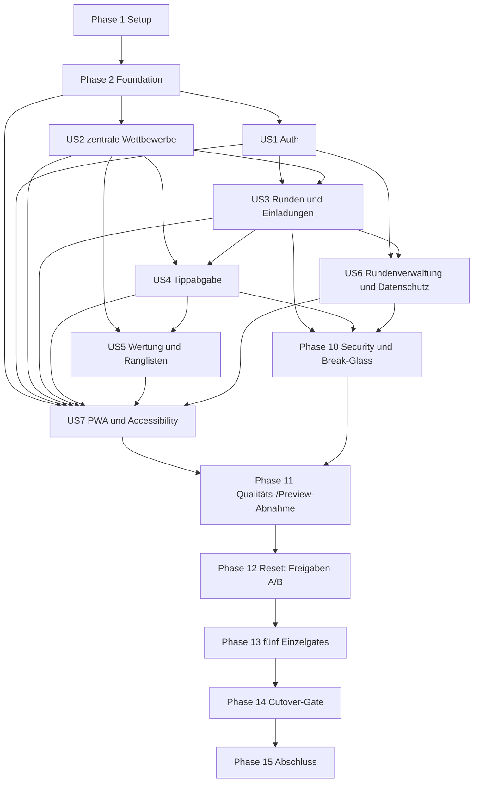

# Tasks: Vollständiger Neubau von A-KlassenHoiz

**Input**: `spec.md`, `plan.md`, `research.md`, `data-model.md`, `contracts/`, `quickstart.md`,
`docs/PRD.md` 1.1 und Projektverfassung 2.0.0  
**Stand**: 2026-07-13  
**Ausführungsstatus**: Implementierung läuft; T001–T090 und T268–T275 abgeschlossen.
Supabase-Freigabe A vom 2026-07-13 wurde ausdrücklich ohne Backup ausgeführt und ist nach der
Nachkontrolle ausgelaufen; Freigabe B für den V2-Rollout wurde am 2026-07-13 ausdrücklich erteilt
**Tests**: Unit-, Komponenten-, Integrations-/Contract-, pgTAP-, RLS-, Storage-, Playwright-E2E-,
Accessibility-, PWA-, Performance- und manuelle Nachweise sind verpflichtend.

## Format: `[ID] [P?] [Story?] Beschreibung mit Dateipfad`

- **[P]**: nach Erfüllung der Phasenvoraussetzungen parallel ausführbar, da andere Dateien und keine
  Abhängigkeit von einer noch offenen Aufgabe derselben Gruppe bestehen
- **[US1]–[US7]**: Zuordnung zur User Story aus `spec.md`
- Tests werden innerhalb jeder Story zuerst geschrieben und müssen aus dem beabsichtigten Grund
  fehlschlagen, bevor die zugehörige Implementierung beginnt.
- Jede Remote-Mutation bleibt bis zu der bei der Aufgabe genannten aktuellen Freigabe blockiert.

---

## Phase 1: Setup und Clean-Room-Baseline

**Zweck**: Neues Repository und reproduzierbare Werkzeugbasis ohne Altcode, alte Modelle oder alte
Migrationen vorbereiten.

- [X] T001 Clean-Room-Ausgangszustand und ausgeschlossene Altquellen inventarisieren in `docs/architecture/clean-room-baseline.md`
- [X] T002 Next.js-16.2.10-/React-19.2.7-Projekt mit exakt gepinnten Produktions- und Testabhängigkeiten anlegen in `package.json` und `package-lock.json`
- [X] T003 TypeScript 6.0.3 mit `strict: true`, sicheren Pfadaliasen und ohne ungeprüfte Suppressions konfigurieren in `tsconfig.json`
- [X] T004 ESLint 9, JSX-A11y, TypeScript-ESLint und Prettier konfigurieren in `eslint.config.mjs` und `.prettierrc.json`
- [X] T005 Geplante Verzeichnis- und Server-only-Grenzen für `app/`, `components/`, `features/`, `lib/`, `styles/`, `tests/`, `scripts/` und `supabase/` anlegen in `docs/architecture/source-layout.md`
- [X] T006 Typisierte, geheimnisfreie Umgebungskonfiguration definieren in `.env.example` und `lib/config/env.ts`
- [X] T007 Technische Sperre gegen versehentliche Remote-Supabase-Befehle im Standardworkflow implementieren in `scripts/verify-local-target.ps1`
- [X] T008 Vitest-, RTL-, Playwright- und Axe-Grundkonfiguration mit deterministischen Zeitzonen anlegen in `vitest.config.ts`, `vitest.setup.ts` und `playwright.config.ts`
- [X] T009 Format-, Lint-, Strict-Typecheck-, Unit- und Build-Workflow erstellen in `.github/workflows/quality.yml`
- [X] T010 Lokalen Supabase-Neuaufbau, DB-Lint, pgTAP, RLS und Storage als CI-Workflow definieren in `.github/workflows/database.yml`
- [X] T011 Production-Build-, Playwright-, Axe-, PWA- und Lighthouse-Gates ohne Remote-Reset definieren in `.github/workflows/e2e.yml` und `.github/workflows/release-gates.yml`
- [X] T012 Dependency-, Secret- und verbotene-Altpfad-Prüfungen konfigurieren in `.github/dependabot.yml` und `scripts/audit-clean-room.ps1`
- [X] T013 Private, nicht-kommerzielle und einladungsbasierte V1-Nutzungsgrenze sowie den Verzicht auf Impressum/private Anschrift-/Steuerangaben ausdrücklich freigeben in `docs/legal/operator-data-flow-approval.md`
- [X] T014 V1-Grenze ohne Produktanalytics, RUM oder private Log-Payloads dokumentieren in `docs/architecture/observability-boundary.md`
- [X] T015 Erforderliche Branch-Protection-Regeln und externe GitHub-Freigabe festlegen in `docs/operations/github-branch-protection.md`
- [X] T016 Gepinnte Laufzeit-/Dependency-Baseline gegen `research.md` prüfen und Ergebnis dokumentieren in `docs/quality/dependency-baseline.md`

**Checkpoint**: Der Greenfield-Arbeitsbereich ist reproduzierbar und enthält keine übernommene
Altimplementierung. T013 ist zwingende Voraussetzung für jede spätere technische Rechtstext-Einbindung.

---

## Phase 2: Foundational – gemeinsame Sicherheits- und UI-Grundlage

**Zweck**: Blockierende Basis für alle User Stories. Keine Story-Implementierung beginnt vor diesem
Checkpoint.

- [X] T017 Lokalen Supabase-Stack mit ausschließlich exponiertem Schema `api`, deaktivierter Registrierungsbestätigung und aktivem Passwort-Reset konfigurieren in `supabase/config.toml`
- [X] T018 Frische V2-Schemas `app`, `private` und `api` mit sicheren Default-Privileges erstellen in `supabase/migrations/20260713000100_create_v2_schemas.sql`
- [X] T019 `PUBLIC`, `anon` und `authenticated` auf Minimal-Grants beschränken und Defaults absichern in `supabase/migrations/20260713000200_harden_privileges.sql`
- [X] T020 Gemeinsame V2-Enums, UUID-/Zeitkonventionen und gehärtete Helper mit leerem `search_path` anlegen in `supabase/migrations/20260713000300_create_core_types_and_helpers.sql`
- [X] T021 [P] Deterministische JWT-Akteure für anon, Nichtmitglied, Member, Owner, App-Admin und gesperrte Profile bereitstellen in `supabase/tests/helpers/actors.sql`
- [X] T022 [P] Fehlende RLS-, Force-RLS-, Grant-, FK-Index- und View-Sicherheitschecks zunächst fehlschlagend anlegen in `supabase/tests/database/000_security_baseline.sql`
- [X] T023 `club-logos`-Bucketvertrag mit Format-, Größen- und Pfadgrenzen als lokale Migration definieren in `supabase/migrations/20260713000400_create_club_logo_storage.sql`
- [X] T024 [P] Public-Read-, App-Admin-Write- und alle Negativfälle für `club-logos` testen in `supabase/tests/storage/000_club_logos.sql`
- [X] T025 Lokale DB-Befehle für Reset, Lint, pgTAP, Typgenerierung und Zielschutz implementieren in `package.json` und `scripts/database.ps1`
- [X] T026 Getrennte Supabase-Browser- und Server-Clients mit Cookie-Sitzungen anlegen in `lib/supabase/browser.ts` und `lib/supabase/server.ts`
- [X] T027 Serverseitige AuthN-/AuthZ-Guards für aktive Profile, Objektzugehörigkeit und App-Adminrolle definieren in `lib/auth/guards.ts`
- [X] T028 Diskriminierte Action-Ergebnisse und privacy-sichere Fehlerabbildung implementieren in `lib/actions/result.ts` und `lib/actions/errors.ts`
- [X] T029 Gemeinsame größenbegrenzte Zod-Schemas und Idempotenzschlüssel validieren in `lib/validation/common.ts`
- [X] T030 Private Daten standardmäßig `no-store` behandeln und nur globale veröffentlichte Daten taggen in `lib/cache/policy.ts`
- [X] T031 PII-, Token-, Tipp- und Rundennamen-Redaktion ohne Analytics-Sink implementieren in `lib/observability/redact.ts` und `lib/observability/logger.ts`
- [X] T032 Gemeinsame Rate-Limit-Schnittstelle für Auth, Einladungen, Autosave und Support definieren in `lib/security/rate-limit.ts`
- [X] T033 Foundation-, Semantic- und Component-Tokens inklusive Kontrast- und Motion-Rollen erstellen in `styles/tokens.css`
- [X] T034 [P] Zugängliche Button-, Input-, Select-, Dialog- und Link-Primitives mit 44×44-Pixel-Zielen anlegen in `components/ui/button.tsx`, `components/ui/input.tsx`, `components/ui/select.tsx`, `components/ui/dialog.tsx` und `components/ui/link.tsx`
- [X] T035 [P] Wiederverwendbare Loading-, Empty-, Error-, Locked-, Success-, Offline- und Destructive-Patterns erstellen in `components/patterns/status-state.tsx` und `components/patterns/destructive-state.tsx`
- [X] T036 Mobile-first Root-Shell mit Skip-Link, Landmarken und fokussicherer Grundnavigation anlegen in `app/layout.tsx` und `components/patterns/app-shell.tsx`
- [X] T037 Deterministische rein synthetische lokale Liga-, Nutzer- und Zeitfixtures definieren in `supabase/seed.sql` und `tests/fixtures/index.ts`
- [X] T038 [P] Testfactorys für Sessions, DB-Akteure, Runden, Spiele und feste DB-Zeit erstellen in `tests/fixtures/factories.ts`
- [X] T039 Reproduzierbare lokale Supabase-Typgenerierung einrichten in `lib/supabase/database.types.ts` und `scripts/generate-database-types.ps1`
- [X] T040 Lokalen Neuaufbau aus ausschließlich V2-Migrationen ausführen und Nachweis für Reset/Lint/pgTAP erfassen in `docs/quality/foundation-database.md`
- [X] T041 Foundation-Checkpoint mit Strict Types, Lint, Unit, DB/RLS, Build und Clean-Room-Audit dokumentieren in `docs/quality/foundation-checkpoint.md`

**Checkpoint**: Gemeinsame Sicherheits-, Test-, Datenzugriffs- und UI-Basis ist grün; User Stories
können gemäß Abhängigkeitsgraph beginnen.

---

## Phase 3: User Story 1 – Registrieren und unmittelbar starten (P1) 🎯 MVP

**Ziel**: E-Mail-/Passwort-Registrierung ohne Bestätigung, Login, Logout, Passwort-Reset und korrekte
kontextabhängige Weiterleitung.

**Independent Test**: Ein neuer Nutzer registriert sich ohne E-Mail-Bestätigung, besitzt sofort eine
Sitzung und landet abhängig von Runden- oder Einladungskontext am richtigen Ziel; Login, Logout und
Passwort-Reset funktionieren mit neutralen Fehlermeldungen.

### Tests für US1

- [X] T042 [P] [US1] Auth-DTOs, Passwortfelder, Redirect-Allowlist und neutrale Fehlercodes unit-testen in `tests/unit/auth/validation.test.ts`
- [X] T043 [P] [US1] Registrierung, sofortige Sitzung, Login, Logout und Reset gegen lokalen Supabase-Auth integrieren in `tests/integration/auth/session-lifecycle.test.ts`
- [X] T044 [P] [US1] Profil-RLS für eigenen, fremden, gesperrten und App-Admin-Akteur testen in `supabase/tests/rls/010_profiles.sql`
- [X] T045 [P] [US1] Mobile Register-/Login-/Reset- und Einladungskontext-Reise in Playwright spezifizieren in `tests/e2e/auth/authentication.spec.ts`
- [X] T046 [P] [US1] Auth-Oberflächen auf Labels, Passwortmanager, Paste, Fokus, Live-Fehler und WCAG 2.2 AA prüfen in `tests/accessibility/auth.spec.ts`

### Implementierung für US1

- [X] T047 [US1] `app.profiles` samt Status, Rolle und letzter-Runde-Präferenz neu migrieren in `supabase/migrations/20260713134842_create_profiles.sql`
- [X] T048 [US1] Profil-RLS, sichere Profil-View und eigene Profilaktualisierung ohne Rollenmutation bereitstellen in `supabase/migrations/20260713134843_expose_profile_api.sql`
- [X] T049 [US1] Auth-Schemas, minimale DTOs und Zielauflösung implementieren in `features/auth/schemas.ts` und `features/auth/types.ts`
- [X] T050 [US1] Register-, Sign-in-, Sign-out- und Passwort-Reset-Service mit `getClaims()`-Prüfung erstellen in `features/auth/service.ts`
- [X] T051 [US1] Dünne authentifizierte Server Actions mit neutraler Fehlerabbildung anlegen in `features/auth/actions.ts`
- [X] T052 [US1] Auth-Callback und Cookie-Refresh-Proxy mit Redirect-Allowlist implementieren in `app/auth/callback/route.ts` und `proxy.ts`
- [X] T053 [US1] Zugängliche Registrierungsansicht mit Anzeigename und unmittelbarer Sitzung erstellen in `app/(public)/register/page.tsx` und `components/auth/register-form.tsx`
- [X] T054 [US1] Loginansicht mit Passwort-Sichtbarkeit und Enumeration-sicherem Feedback erstellen in `app/(public)/login/page.tsx` und `components/auth/login-form.tsx`
- [X] T055 [US1] Passwort-vergessen- und Passwort-neu-setzen-Abläufe implementieren in `app/(public)/password/forgot/page.tsx` und `app/(public)/password/reset/page.tsx`
- [X] T056 [US1] Einladungskontext servergebunden über Auth-Übergänge erhalten in `features/auth/invitation-context.ts`
- [X] T057 [US1] Weiterleitung für null, eine, mehrere Runden und offene Einladung implementieren in `features/auth/post-login-destination.ts`
- [X] T058 [US1] Profil-, Logout- und Sitzungsfehlerzustände bereitstellen in `app/(authenticated)/profile/page.tsx` und `components/auth/session-menu.tsx`
- [X] T059 [US1] Auth-Rate-Limits und redigierte technische Ereignisse integrieren in `features/auth/security.ts`
- [X] T060 [US1] Vollständigen US1-Testslice ausführen und unabhängigen Nachweis erfassen in `docs/quality/us1-authentication.md`

**Checkpoint**: US1 ist unabhängig abnehmbar; globale Wettbewerbe oder private Runden sind dafür
nicht erforderlich.

---

## Phase 4: User Story 2 – Wettbewerb zentral vorbereiten (P2)

**Ziel**: App-Admins verwalten zentrale Ligen, Saisons, Liga-Saisons, Vereine, Spieltage, Spiele und
Ergebnisse; normale Nutzer sehen nur Veröffentliches und können nichts mutieren.

**Independent Test**: Ein operativ provisionierter App-Admin legt eine vollständige Liga-Saison an
und veröffentlicht sie; normale Nutzer lesen nur veröffentlichte Daten, alle Mutationen werden
serverseitig und durch RLS verweigert. Private Supportzugriffe sind kein Bestandteil dieses Checkpoints.

### Tests für US2

- [X] T061 [P] [US2] Liga-/Saison-/Vereins-/Spieltag-/Spiel-/Ergebnis-Constraints und Statusübergänge pgTAP-testen in `supabase/tests/database/020_competition_constraints.sql`
- [X] T062 [P] [US2] App-Admin-Allow sowie User-/Member-/Owner-Deny für alle globalen Tabellen, Views und RPCs testen in `supabase/tests/rls/020_competition_admin.sql`
- [X] T063 [P] [US2] Vereinslogo-MIME, Größe, Pfadversionierung und Schreibrollen testen in `supabase/tests/storage/020_club_logos.sql`
- [X] T064 [P] [US2] Admin-RPC-Verträge, Optimistic Concurrency und historische Korrekturpfade integrieren in `tests/integration/competition/admin-actions.test.ts`
- [X] T065 [P] [US2] Mobile Admin-Reise von Liga bis Veröffentlichung und Ergebniskorrektur spezifizieren in `tests/e2e/admin/competition.spec.ts`
- [X] T066 [P] [US2] Adminformulare, Statusmeldungen, Tabellen und Dialoge mit Axe und Tastatur testen in `tests/accessibility/admin-competition.spec.ts`

### Implementierung für US2

- [X] T067 [US2] `leagues`, `seasons` und `league_seasons` mit Versionen und Lifecycle neu migrieren in `supabase/migrations/20260713140327_create_league_seasons.sql`
- [X] T068 [US2] `clubs` und `league_season_clubs` samt Eindeutigkeit und Historienstatus migrieren in `supabase/migrations/20260713140329_create_clubs.sql`
- [X] T069 [US2] `matchdays` und `matches` mit Zeitzonen-, Vereins- und Duplikatconstraints migrieren in `supabase/migrations/20260713140332_create_schedule.sql`
- [X] T070 [US2] `match_results` und append-only `result_revisions` als zentrale Ergebnisbasis migrieren in `supabase/migrations/20260713140334_create_results.sql`
- [X] T071 [US2] FK-, RLS- und Adminfilter-Indizes sowie konsistente Lock-Reihenfolge ergänzen in `supabase/migrations/20260713140336_index_competition.sql`
- [X] T072 [US2] RLS und Minimal-Grants für Entwürfe, veröffentlichte Daten und App-Adminmutationen definieren in `supabase/migrations/20260713140339_secure_competition.sql`
- [X] T073 [US2] `security_invoker`-Read-Models für veröffentlichte Liga-Saisons und Spielpläne bereitstellen in `supabase/migrations/20260713140341_expose_competition_reads.sql`
- [X] T074 [US2] Versionierte Liga-/Saison-/Liga-Saison-Lifecycle-RPCs implementieren in `supabase/migrations/20260713140343_create_league_season_rpcs.sql`
- [X] T075 [US2] Vereinszuordnung und sichere Vereinslogo-Pfadverwaltung als RPCs implementieren in `supabase/migrations/20260713140346_create_club_rpcs.sql`
- [X] T076 [US2] Spieltag-/Spiel-RPCs mit Verschiebung, Archivierung und Korrektur statt Hard Delete erstellen in `supabase/migrations/20260713140349_create_schedule_rpcs.sql`
- [X] T077 [US2] Zentrale Ergebnis-/Revisions-RPC zunächst ohne Wertungskopplung erstellen in `supabase/migrations/20260713140351_create_result_rpcs.sql`
- [X] T078 [US2] App-Admin-geschützten Logo-Upload mit serverseitiger Validierung implementieren in `features/competition/logo-service.ts`
- [X] T079 [US2] Strikte Wettbewerbs-Schemas und minimale DTOs definieren in `features/competition/schemas.ts` und `features/competition/types.ts`
- [X] T080 [US2] Liga-/Saison-/Liga-Saison-Service und Actions implementieren in `features/competition/league-service.ts` und `features/competition/league-actions.ts`
- [X] T081 [US2] Vereins-/Zuordnungs-Service und Actions implementieren in `features/competition/club-service.ts` und `features/competition/club-actions.ts`
- [X] T082 [US2] Spieltag-/Spiel-Service und Actions mit Versionskonflikten implementieren in `features/competition/schedule-service.ts` und `features/competition/schedule-actions.ts`
- [X] T083 [US2] Ergebnis-/Revisions-Service und Actions mit globaler Wirkung implementieren in `features/competition/result-service.ts` und `features/competition/result-actions.ts`
- [X] T084 [US2] Ausschließlich App-Admins zugängliche Admin-Shell und Navigation erstellen in `app/admin/layout.tsx` und `components/competition/admin-navigation.tsx`
- [X] T085 [US2] Liga-, Saison- und Liga-Saison-Verwaltungsseiten erstellen in `app/admin/competitions/page.tsx` und `components/competition/league-season-form.tsx`
- [X] T086 [US2] Vereinsliste, Zuordnung und Logoformular implementieren in `app/admin/clubs/page.tsx` und `components/competition/club-form.tsx`
- [X] T087 [US2] Bulk-freundliche Spieltag-/Spielverwaltung mit Konfliktfeedback erstellen in `app/admin/schedule/page.tsx` und `components/competition/match-editor.tsx`
- [X] T088 [US2] Ergebnisverwaltung mit Revision, Ausschluss und starker Korrekturwarnung erstellen in `app/admin/results/page.tsx` und `components/competition/result-form.tsx`
- [X] T089 [US2] Veröffentlichte Liga-Saison-Auswahl als nutzerlesbares Read Model integrieren in `features/competition/public-service.ts`
- [X] T090 [US2] US2 einschließlich App-Admin-Allow/User-Deny unabhängig von privaten Supportfunktionen abnehmen in `docs/quality/us2-central-competition.md`

**Checkpoint**: Zentrale Wettbewerbsdaten sind eigenständig verwaltbar und veröffentlicht lesbar;
US2 ist unabhängig von privaten Supportfunktionen abgenommen.

---

## Phase 5: User Story 3 – Private Tipprunde erstellen und Freunde einladen (P3)

**Ziel**: Angemeldete Nutzer erstellen private Runden für eine veröffentlichte Liga-Saison und
laden per sicherem Link und QR-Code ein.

**Independent Test**: Ein Nutzer erstellt atomar genau eine Runde mit genau einem Owner, rotiert
eine siebentägige Einladung und ein zweiter Nutzer tritt mit eindeutigem Nickname genau einmal bei.

### Tests für US3

- [X] T091 [P] [US3] Runden-, Owner-, Mitgliedschafts-, Nickname- und Liga-Saison-Invarianten pgTAP-testen in `supabase/tests/database/030_round_creation.sql`
- [X] T092 [P] [US3] Tokenhash, Rotation, Ablauf, Widerruf und Doppelbeitritt pgTAP-testen in `supabase/tests/database/031_invitations.sql`
- [X] T093 [P] [US3] Nichtmitglied-, Cross-Round-, Owner- und App-Admin-Normalbetrieb für Runden/Einladungen testen in `supabase/tests/rls/030_rounds_and_invitations.sql`
- [X] T094 [P] [US3] Create-/Join-/Rotate-Verträge, Idempotenz und Parallelität integrieren in `tests/integration/rounds/round-and-invitation.test.ts`
- [X] T095 [P] [US3] Mobile Runde-erstellen-, Link-/QR- und Gast-zu-Mitglied-Reise spezifizieren in `tests/e2e/rounds/create-and-join.spec.ts`
- [X] T096 [P] [US3] Erstellungsflow, Einladungsvorschau, QR-Dialog und Beitrittsformular zugänglich testen in `tests/accessibility/rounds-and-invitations.spec.ts`
- [X] T097 [P] [US3] Zwei-Minuten-Rundenerstellungsaufgabe mit definiertem Start/Ende testbar machen in `tests/e2e/rounds/create-round-timing.spec.ts`

### Implementierung für US3

- [X] T098 [US3] `prediction_rounds` und `round_memberships` mit ausschließlich `owner`/`member` migrieren in `supabase/migrations/20260713155208_create_rounds.sql`
- [X] T099 [US3] Gehashte `private.invitations` mit genau einer aktiven Einladung je Runde migrieren in `supabase/migrations/20260713155211_create_invitations.sql`
- [X] T100 [US3] Deferrable Ownerreferenz, partiellen Ownerindex und aktive Nickname-/User-Eindeutigkeit implementieren in `supabase/migrations/20260713155213_enforce_round_invariants.sql`
- [X] T101 [US3] RLS/Grants für eigene Runden, Mitgliedschaften und strikt private Einladungen definieren in `supabase/migrations/20260713155215_secure_rounds.sql`
- [X] T102 [US3] Sichere Rundenliste, Basisübersicht und minimale Einladungsvorschau exponieren in `supabase/migrations/20260713155217_expose_round_reads.sql`
- [X] T103 [US3] Atomare, idempotente Rundenerstellung und Liga-Saison-Änderung vor erstem Tipp implementieren in `supabase/migrations/20260713155220_create_round_rpcs.sql`
- [X] T104 [US3] Einladungsrotation mit 256-Bit-Token, SHA-256 und DB-Frist implementieren in `supabase/migrations/20260713155222_create_invitation_rpcs.sql`
- [X] T105 [US3] Idempotenten Beitritt mit Token-, Frist- und Nickname-Prüfung implementieren in `supabase/migrations/20260713155224_create_join_round_rpc.sql`
- [X] T106 [US3] Runden-/Mitgliedschafts-Schemas und DTOs definieren in `features/rounds/schemas.ts` und `features/rounds/types.ts`
- [X] T107 [US3] Serverseitigen Rundenservice und dünne Actions implementieren in `features/rounds/service.ts` und `features/rounds/actions.ts`
- [X] T108 [US3] Einladungsvorschau, Rotation und Beitritt ohne Tokenlogging implementieren in `features/invitations/service.ts` und `features/invitations/actions.ts`
- [X] T109 [US3] Geführten Erstellungsflow für Name, Liga-Saison, Nickname und Zusammenfassung bauen in `app/(authenticated)/rounds/new/page.tsx` und `components/rounds/create-round-flow.tsx`
- [X] T110 [US3] Eigene Rundenliste und berechtigungsgeprüften Rundenwechsel implementieren in `components/rounds/round-switcher.tsx`
- [X] T111 [US3] Rundenübersicht mit nächstem Spieltag-Platzhalter und primärer Tippaktion anlegen in `app/(authenticated)/rounds/[roundId]/page.tsx`
- [X] T112 [US3] Owner-Einstellungsgrundseite ohne Co-Admin- oder globale Verwaltungsfunktionen erstellen in `app/(authenticated)/rounds/[roundId]/settings/page.tsx`
- [X] T113 [US3] Einladungslink kopieren, teilen, widerrufen und ersetzen in `components/rounds/invitation-panel.tsx`
- [X] T114 [US3] QR-Renderer bedarfsweise laden und Klartexttoken nur im aktuellen Clientkontext halten in `components/rounds/invitation-qr.tsx`
- [X] T115 [US3] Öffentliche neutrale Einladungsvorschau implementieren in `app/(public)/invite/[token]/page.tsx`
- [X] T116 [US3] Auth-Rückkehr zum ursprünglichen Einladungskontext integrieren in `features/invitations/auth-return.ts`
- [X] T117 [US3] Beitrittsbestätigung mit eindeutigem Rundennickname und bestehendes-Mitglied-Pfad erstellen in `components/rounds/join-round-form.tsx`
- [X] T118 [US3] Gesamten US3-Testslice einschließlich Parallelitäts- und App-Admin-Deny-Fällen ausführen in `docs/quality/us3-rounds-and-invitations.md`
- [X] T119 [US3] Unabhängigen Zwei-Nutzer-/Link-/QR-Abnahmenachweis dokumentieren in `docs/quality/us3-independent-acceptance.md`

**Checkpoint**: Private Runden und Einladungen funktionieren ohne Tipps, Wertung oder Break-Glass
vollständig und isoliert.

---

## Phase 6: User Story 4 – Einen Spieltag schnell und fristgerecht tippen (P4)

**Ziel**: Mobile Autosave-Tippabgabe mit ehrlichem Status, Serverfrist je Spiel und sicherer
Fremdtippsichtbarkeit.

**Independent Test**: Ein Mitglied tippt acht Spiele mobil in unter drei Minuten; die DB akzeptiert
vor, verweigert exakt ab Anpfiff und gibt fremde Tipps je Spiel erst nach dessen Frist frei.

### Tests für US4

- [X] T120 [P] [US4] Autosave-State-Machine, Validierung und Fehlererhalt unit-testen in `tests/unit/predictions/autosave-state.test.ts`
- [X] T121 [P] [US4] Tippconstraints und DB-Frist eine Sekunde vor, exakt bei und nach Anpfiff pgTAP-testen in `supabase/tests/database/040_prediction_deadlines.sql`
- [X] T122 [P] [US4] Eigene/fremde Tipps, Cross-Round-IDs, andere Liga-Saison und App-Admin-Deny RLS-testen in `supabase/tests/rls/040_predictions.sql`
- [X] T123 [P] [US4] Doppelautosave, zwei Clients und Anstoßänderung gegen Speichern integrieren in `tests/integration/predictions/save-prediction.test.ts`
- [X] T124 [P] [US4] Acht-Spiele-Mobile-Reise inklusive Offline/Retry, Verschiebung und Absage spezifizieren in `tests/e2e/predictions/predict-matchday.spec.ts`
- [X] T125 [P] [US4] Numerische Eingabe, Labels, Live-Status, Fokus und Locked-Zustand zugänglich testen in `tests/accessibility/predictions.spec.ts`

### Implementierung für US4

- [X] T126 [US4] `predictions` mit Runden-/Mitgliedschafts-/Spielbezug und 0–99-Torwerten migrieren in `supabase/migrations/20260713002600_create_predictions.sql`
- [X] T127 [US4] Unique-/FK-/Liga-Saison-Constraints und Sichtbarkeitsindizes für Tipps erstellen in `supabase/migrations/20260713002700_enforce_prediction_invariants.sql`
- [X] T128 [US4] Direktes Tipp-DML sperren und zeit-/mitgliedschaftsabhängige RLS-Regeln definieren in `supabase/migrations/20260713002800_secure_predictions.sql`
- [X] T129 [US4] `save_prediction` mit Match-Lock, `clock_timestamp()`, Idempotenz und `has_predictions` implementieren in `supabase/migrations/20260713002900_create_save_prediction_rpc.sql`
- [X] T130 [US4] `round_overview` und `matchday_prediction_sheet` als minimale `security_invoker`-Views erstellen in `supabase/migrations/20260713003000_expose_prediction_sheet.sql`
- [X] T131 [US4] Fremdtipp-Read-Model je Einzelspielfrist ohne App-Admin-Bypass erstellen in `supabase/migrations/20260713003100_expose_visible_predictions.sql`
- [X] T132 [US4] Tipp-Schemas, DTOs und Serverbestätigungszustände definieren in `features/predictions/schemas.ts` und `features/predictions/types.ts`
- [X] T133 [US4] Autorisierten Tippservice und Action mit DB-Fehlerabbildung implementieren in `features/predictions/service.ts` und `features/predictions/actions.ts`
- [X] T134 [US4] Spieltagsauswahl mit nächstem unvollständigen Spieltag erstellen in `components/predictions/matchday-selector.tsx`
- [X] T135 [US4] Zugängliche Spielkarte mit Logos/Fallback, Anstoß und zwei numerischen Eingaben bauen in `components/predictions/prediction-card.tsx`
- [X] T136 [US4] Pro Spiel serialisierten/debouncten Autosave ohne Offlinequeue implementieren in `features/predictions/use-prediction-autosave.ts`
- [X] T137 [US4] Fortschritt und Zustände incomplete/saving/saved/error/locked unmittelbar anzeigen in `components/predictions/prediction-progress.tsx`
- [X] T138 [US4] Offline-/Reconnect-Verhalten ohne falsche Speicherbestätigung integrieren in `features/predictions/connectivity.ts`
- [X] T139 [US4] Verschobene, abgesagte, abgebrochene und abgelaufene Spielzustände darstellen in `components/predictions/match-status.tsx`
- [X] T140 [US4] Fremde Tipps nach individueller Frist als read-only Ansicht bereitstellen in `components/predictions/visible-predictions.tsx`
- [X] T141 [US4] Eng begrenzte Cacheinvalidierung für Tipp, Übersicht und Sichtbarkeit implementieren in `features/predictions/cache.ts`
- [X] T142 [US4] Idempotenz-/Parallelitätsgrenzen mit stabiler Lock-Reihenfolge verifizieren in `docs/quality/us4-concurrency.md`
- [X] T143 [US4] Vollständigen US4-Unit-/DB-/RLS-/Integration-/E2E-/Axe-Slice ausführen in `docs/quality/us4-predictions.md`
- [X] T144 [US4] Drei-Minuten-Medianmessung für acht Spiele bei 375 Pixeln dokumentieren in `docs/quality/us4-mobile-timing.md`

**Checkpoint**: Tippabgabe ist serverautoritativ, mobil schnell und ohne Break-Glass-Abhängigkeit
abnehmbar.

---

## Phase 7: User Story 5 – Punkte und Ranglisten nachvollziehen (P5)

**Ziel**: Kanonische 4/3/2/0-Wertung, atomare Ergebnisneuberechnung sowie Gesamt- und
Spieltagsranglisten.

**Independent Test**: Repräsentative und randwertige Tipps liefern deterministisch 4/3/2/0;
Ergebniskorrekturen ersetzen alle betroffenen Wertungen atomar und beide Ranglisten stimmen mit
einem vollständigen Rebuild überein.

### Tests für US5

- [X] T145 [P] [US5] Vollständige Score-Vektoren einschließlich nicht exaktem Remis pgTAP-testen in `supabase/tests/database/050_scoring.sql`
- [X] T146 [P] [US5] Ergebnisrevision, atomare Recalc und Rollback bei Fehler pgTAP-testen in `supabase/tests/database/051_result_recalculation.sql`
- [X] T147 [P] [US5] Gesamt-/Spieltagsrang, geteilte Plätze und alphabetische Anzeige testen in `supabase/tests/database/052_rankings.sql`
- [X] T148 [P] [US5] Wertungs-/Ranglisten-RLS für Member, Cross-Round und App-Admin ohne Mitgliedschaft testen in `supabase/tests/rls/050_scores_and_rankings.sql`
- [X] T149 [P] [US5] Ergebnisaktion, Recalc, Revision und Full-Rebuild-Gleichheit integrieren in `tests/integration/scoring/result-recalculation.test.ts`
- [X] T150 [P] [US5] Zwei-Runden-Ergebnis-, Punkte- und Ranglistenreise in Playwright spezifizieren in `tests/e2e/rankings/scoring-and-rankings.spec.ts`
- [X] T151 [P] [US5] Mobile Ranglisten und Ergebnisrevisionen semantisch/Axe-testen in `tests/accessibility/rankings.spec.ts`

### Implementierung für US5

- [X] T152 [US5] `prediction_scores` mit Revisions- und Berechnungsversion migrieren in `supabase/migrations/20260713003200_create_prediction_scores.sql`
- [X] T153 [US5] Einzige `IMMUTABLE STRICT` 4/3/2/0-Funktion mit `calculation_version = 1` implementieren in `supabase/migrations/20260713003300_create_score_function.sql`
- [X] T154 [US5] Kurze, stabil geordnete Recalc-/Recovery-Funktionen für ein Spiel erstellen in `supabase/migrations/20260713003400_create_score_recalculation.sql`
- [X] T155 [US5] Ergebnis-RPC um Revision und vollständige atomare Wertungsneuberechnung erweitern in `supabase/migrations/20260713003500_integrate_results_and_scores.sql`
- [X] T156 [US5] `overall_ranking` und `matchday_ranking` mit SQL `rank()` und minimalen Spalten exponieren in `supabase/migrations/20260713003600_expose_rankings.sql`
- [X] T157 [US5] Ergebnis-Read-Model mit Revisionsmarkierung und Wertungsausschluss erweitern in `supabase/migrations/20260713003700_expose_results.sql`
- [X] T158 [US5] Ranking-/Ergebnis-Schemas, Services und Actions implementieren in `features/rankings/service.ts`, `features/rankings/actions.ts`, `features/scoring/service.ts` und `features/scoring/types.ts`
- [X] T159 [US5] Ergebnisformular um Recalc-Bestätigung und betroffene Wertungsanzahl ergänzen in `components/competition/result-form.tsx`
- [X] T160 [US5] Mitglieder-Ergebnisansicht mit Korrekturhinweis erstellen in `app/(authenticated)/rounds/[roundId]/results/page.tsx`
- [X] T161 [US5] Gesamt- und Spieltagsranglisten mit eigener Hervorhebung erstellen in `app/(authenticated)/rounds/[roundId]/rankings/page.tsx`
- [X] T162 [US5] Historische/anonymisierte Nicknames und Mitgliedsstatus konsistent rendern in `components/rankings/ranking-row.tsx`
- [X] T163 [US5] Operatives Full-Rebuild-Skript ohne zweite Wertungslogik bereitstellen in `scripts/operations/rebuild-scores.ps1`
- [X] T164 [US5] Revisionshinweis in Rundenübersicht und Ergebnisansicht integrieren in `components/rounds/result-revision-notice.tsx`
- [X] T165 [US5] Ranking-/Recalc-Indizes mit `EXPLAIN (ANALYZE, BUFFERS)` prüfen in `docs/quality/us5-query-plans.md`
- [X] T166 [US5] Vollständigen US5-Testslice ausführen in `docs/quality/us5-scoring-and-rankings.md`
- [X] T167 [US5] Recalc-gleich-Rebuild und zentrale Wiederverwendung durch zwei Runden dokumentieren in `docs/quality/us5-independent-acceptance.md`

**Checkpoint**: Wertung und Ranglisten sind deterministisch, vollständig getestet und niemals
manuell gepflegt.

---

## Phase 8: User Story 6 – Tipprunde als alleiniger Besitzer verwalten (P6)

**Ziel**: Owner-only Verwaltung, atomarer Besitztransfer, Entfernen/Austritt, reversible
Archivierung, irreversibler Runden-Hard-Delete und datenschutzkonforme Kontolöschung ohne Co-Admins.

**Independent Test**: Kein Pfad erzeugt null/mehrere Owner oder Co-Admins; der Hard Delete verlangt
den exakten Rundennamen und löscht alles Private atomar, lässt globale Daten/Konten unverändert und
hinterlässt nur das minimale PII-freie Audit.

### Tests für US6

- [X] T168 [P] [US6] Verwaltungs-, Namensbestätigungs- und Kontolösch-Schemas unit-testen in `tests/unit/rounds/management-validation.test.ts`
- [X] T169 [P] [US6] Ownertransfer, letzter Owner und parallele Entfernung pgTAP-testen in `supabase/tests/database/060_ownership_lifecycle.sql`
- [X] T170 [P] [US6] Entfernen, Austritt, Archivierung und Reaktivierung integrieren in `tests/integration/rounds/membership-lifecycle.test.ts`
- [X] T171 [P] [US6] Hard Delete, Rollback, Minimal-Audit und Erhalt globaler Daten/Konten pgTAP-testen in `supabase/tests/database/061_round_hard_delete.sql`
- [X] T172 [P] [US6] Owner-/Member-/App-Admin-Deny für alle privaten Verwaltungs-RPCs RLS-testen in `supabase/tests/rls/060_round_management.sql`
- [X] T173 [P] [US6] Per-Runde-Anonymisierung, `deletion_pending` und idempotentes Auth-Delete integrieren in `tests/integration/privacy/delete-account.test.ts`
- [X] T174 [P] [US6] Ownertransfer, Mitgliederentfernung, Archivierung und Löschung E2E-testen in `tests/e2e/rounds/manage-round.spec.ts`
- [X] T175 [P] [US6] Destruktivdialoge, Fokus, Warnungen und Konto-Löschablauf zugänglich testen in `tests/accessibility/destructive-actions.spec.ts`

### Implementierung für US6

- [X] T176 [US6] FK-loses append-only `private.destructive_audit_events` migrieren in `supabase/migrations/20260713003800_create_destructive_audit.sql`
- [X] T177 [US6] Rundennamen-/Nickname-Update und atomaren Ownertransfer als RPCs implementieren in `supabase/migrations/20260713003900_create_round_management_rpcs.sql`
- [X] T178 [US6] Member-Entfernen und Austritt mit sofortigem RLS-Entzug implementieren in `supabase/migrations/20260713004000_create_membership_lifecycle_rpcs.sql`
- [X] T179 [US6] Reversible Archivierung/Reaktivierung mit Ownerprüfung implementieren in `supabase/migrations/20260713004100_create_round_archive_rpcs.sql`
- [X] T180 [US6] Transaktionalen Hard Delete nach exakter Namens-/Versionsprüfung implementieren in `supabase/migrations/20260713004200_create_round_hard_delete_rpc.sql`
- [X] T181 [US6] Profil-/Mitgliedschaftsentkopplung mit stabilem anonymem Platzhalter migrieren in `supabase/migrations/20260713004300_create_account_anonymization_rpc.sql`
- [X] T182 [US6] Idempotente server-only Auth-Admin-Löschsaga mit `deletion_pending` implementieren in `features/privacy/delete-account.ts`
- [X] T183 [US6] Owner-Verwaltungsservice und Actions ohne Co-Adminpfad implementieren in `features/rounds/management-service.ts` und `features/rounds/management-actions.ts`
- [X] T184 [US6] Konto-Löschservice, erneute Authentifizierung und Fehlerwiederaufnahme implementieren in `features/privacy/service.ts` und `features/privacy/actions.ts`
- [X] T185 [US6] Runden-Einstellungsseite um Namen, Nickname und Lifecycle erweitern in `app/(authenticated)/rounds/[roundId]/settings/page.tsx`
- [X] T186 [US6] Mitgliederliste mit Entfernen/Austritt und historischem Status erstellen in `components/rounds/member-management.tsx`
- [X] T187 [US6] Zugänglichen Ownertransfer-Dialog mit atomarer Bestätigung bauen in `components/rounds/transfer-ownership-dialog.tsx`
- [X] T188 [US6] Archivieren als visuell priorisierte reversible Standardaktion umsetzen in `components/rounds/archive-round-dialog.tsx`
- [X] T189 [US6] Irreversiblen Hard-Delete-Dialog mit exakter Rundennamenseingabe bauen in `components/rounds/delete-round-dialog.tsx`
- [X] T190 [US6] Konto-Löschoberfläche mit Owner-Vorbedingungen und Fortschrittszustand erstellen in `app/(authenticated)/profile/delete-account/page.tsx`
- [X] T191 [US6] Ausgeschiedene und anonymisierte Mitglieder historisch korrekt darstellen in `components/rankings/historical-member-label.tsx`
- [X] T192 [US6] Automatischen Scan gegen Co-Admin-Enums, Policies, Actions und UI-Texte erstellen in `scripts/audit-no-co-admin.ps1`
- [X] T193 [US6] App-Admin-Normalbetrieb gegen Bearbeiten, Entfernen, Einladen und Tippmutationen verifizieren in `docs/quality/us6-app-admin-private-deny.md`
- [X] T194 [US6] Ownertransfer-/Entfernungs-/Hard-Delete-Parallelität vollständig ausführen in `docs/quality/us6-concurrency.md`
- [X] T195 [US6] Vollständigen US6-Testslice ausführen in `docs/quality/us6-round-management.md`
- [X] T196 [US6] Atomaren Hard-Delete-Nachweis einschließlich Null-Partial-Commit dokumentieren in `docs/quality/us6-hard-delete-acceptance.md`

**Checkpoint**: Genau ein Owner und keine Co-Admins sind auf DB-, Server- und UI-Ebene bewiesen;
Archiv und Hard Delete besitzen klar getrennte Semantik.

---

## Phase 9: User Story 7 – Als barrierefreie PWA auf jedem Zielgerät nutzen (P7)

**Ziel**: Vollständige mobile-first, responsive, installierbare und WCAG-2.2-AA-konforme PWA ohne
Offline-Tippqueue.

**Independent Test**: Die kritische Reise funktioniert bei 375 Pixeln, per Tastatur und im
installierten Modus; Offline-/Updatezustände behaupten keine unbestätigte Speicherung.

### Tests für US7

- [X] T197 [P] [US7] Shared Components auf Zustände, Kontrastrollen und Fokus unit-/component-testen in `tests/component/design-system.test.tsx`
- [X] T198 [P] [US7] Kernreisen bei 320/375/768/1024/1440 Pixeln ohne Seitenscroll E2E-testen in `tests/e2e/responsive/core-journeys.spec.ts`
- [X] T199 [P] [US7] Manifest, Icons, Service-Worker, Offline-Fallback und Updatepfad automatisieren in `tests/pwa/installability.spec.ts`
- [X] T200 [P] [US7] Service-Worker-Caches auf private HTML-, RSC-, Auth- und Supabase-Antworten prüfen in `tests/pwa/private-cache-deny.spec.ts`
- [X] T201 [P] [US7] Manuelle Keyboard-/Screenreader-/Zoom-/High-Contrast-/Reduced-Motion-Matrix vorbereiten in `docs/quality/manual-accessibility-protocol.md`

### Implementierung für US7

- [X] T202 [US7] Mobile Rundennavigation auf exakt Übersicht, Tippen, Rangliste und Ergebnisse begrenzen in `components/patterns/round-navigation.tsx`
- [X] T203 [US7] Responsive Shell-, Grid-, Spacing- und Safe-Area-Regeln vervollständigen in `styles/globals.css` und `styles/utilities.css`
- [X] T204 [US7] Barlow/Barlow-Condensed oder freigegebene gleichwertige Schrift mit `next/font` integrieren in `app/fonts.ts`
- [X] T205 [US7] Sämtliche UI-Primitives mit Hover/Focus/Pressed/Disabled/Loading/Error/Reduced-Motion dokumentieren in `docs/design/components.md`
- [X] T206 [US7] Formfehler, Live-Regionen, Fokusführung und wahrheitsgemäße Speicherzustände vereinheitlichen in `components/patterns/form-status.tsx`
- [X] T207 [US7] Ranglisten in zugängliche mobile Liste/kompakte Tabelle überführen in `components/rankings/responsive-ranking.tsx`
- [X] T208 [US7] Globale Adminoberflächen für Touch, Reflow und Tastatur vervollständigen in `components/competition/admin-responsive-layout.tsx`
- [X] T209 [US7] Vollständiges PWA-Manifest mit eigenem Namen, Farben und Iconverweisen erstellen in `app/manifest.ts`
- [X] T210 [US7] Eigenständige SVG-Master-, 32-/192-/512- und Maskable-App-Icons erstellen in `public/icons/app-icon.svg`, `public/icons/icon-192.png`, `public/icons/icon-512.png` und `public/icons/icon-maskable-512.png`
- [X] T211 [US7] Kleinen first-party Service Worker mit öffentlicher Allowlist und network-first Navigation implementieren in `public/sw.js`
- [X] T212 [US7] Öffentliche Offline-Fallbackseite ohne Tippbestätigung erstellen in `app/offline/page.tsx`
- [X] T213 [US7] Sicheren Service-Worker-Updatehinweis ohne Verlust lokaler Eingaben implementieren in `components/patterns/app-update-notice.tsx`
- [X] T214 [US7] Installationshinweise für Android, Desktop und iOS ohne alleinige `beforeinstallprompt`-Abhängigkeit erstellen in `components/patterns/install-app.tsx`
- [X] T215 [US7] Safe-Area-, Portrait-/Landscape- und Standalone-Verhalten implementieren in `styles/pwa.css`
- [X] T216 [US7] Reduced-Motion-, High-Contrast- und nicht-farbgebundene Statusvarianten vervollständigen in `styles/accessibility.css`
- [X] T217 [US7] Fokus-nicht-verdeckt, 200%-Text und 400%-Zoom/Reflow in Kernlayouts beheben in `components/patterns/focus-boundary.tsx`
- [X] T218 [US7] Ausschließlich nach bestandenem T013-Gate den privaten Nutzungs-/Datenschutzhinweis ohne Impressum oder private Anschrift-/Steuerangaben einbinden in `app/(public)/legal/privacy/page.tsx`
- [X] T219 [US7] Datenschutz-, Konto- und Fehlermicrocopy ohne erfundene Rechtsangaben finalisieren in `features/privacy/copy.ts`
- [X] T220 [US7] Produkttexte und Icons auf Tipp-/Punkte-/Gemeinschaftssprache ohne Wettbegriffe prüfen in `docs/quality/product-language-review.md`
- [X] T221 [US7] Product-Owner-V1-Ausnahme für nicht ausgeführte reale PWA-Installationen transparent dokumentieren in `docs/quality/pwa-real-device.md`
- [X] T222 [US7] Vollständigen automatisierten US7-Responsive-/Axe-/PWA-Slice ausführen in `docs/quality/us7-pwa-accessibility.md`
- [X] T223 [US7] Product-Owner-V1-Ausnahme für die zurückgestellte manuelle WCAG-/Screenreader-Matrix dokumentieren in `docs/quality/us7-manual-accessibility.md`

**Checkpoint**: Mobile-first, PWA und WCAG 2.2 AA sind als Produktqualität über alle Storys belegt.

---

## Phase 10: Querschnittliche Security, Break-Glass und Hardening

**Zweck**: Break-Glass bleibt außerhalb von US2 und wird erst mit vorhandenen privaten Tabellen und
Tipps als eigener Security-/Operations-Slice umgesetzt.

- [X] T224 [P] Break-Glass-Grant, Maximaldauer, Scope, Pflichtgrund, Ablauf und Append-only-Audit pgTAP-testen in `supabase/tests/database/080_support_access.sql`
- [X] T225 [P] Read-only Scope, Widerruf sowie Prediction-/E-Mail-/Listen-/Export-/Mutationsdeny integrieren in `tests/integration/support/break-glass.test.ts`
- [X] T226 [P] Zeitlich begrenzte Supportmetadaten-Reise ohne Browsing oder Privatdaten E2E-testen in `tests/e2e/admin/support-metadata.spec.ts`
- [X] T227 `private.support_access_grants` und append-only `app.admin_access_events` migrieren in `supabase/migrations/20260713004400_create_support_access.sql`
- [X] T228 RLS/Grants so definieren, dass App-Admins keine privaten Basistabellen oder E-Mail-/Tippquellen lesen in `supabase/migrations/20260713004500_secure_support_access.sql`
- [X] T229 Fall-/Runden-/Allowlistgebundene Grant-RPC mit maximal 15 Minuten Laufzeit implementieren in `supabase/migrations/20260713004600_create_support_grant_rpc.sql`
- [X] T230 Exakt eine read-only Supportmetadatenabfrage mit Zugriffsaudit implementieren in `supabase/migrations/20260713004700_create_support_read_rpc.sql`
- [X] T231 Serverseitige Support-Schemas, Services und Actions ohne Listen-/Exportpfad erstellen in `features/support/schemas.ts`, `features/support/service.ts` und `features/support/actions.ts`
- [X] T232 Pflichtbegründungs- und Scope-Formular mit zeitlich begrenzter Ergebnisansicht erstellen in `app/admin/support/page.tsx` und `components/competition/support-access-form.tsx`
- [X] T233 Eng begrenztes append-only Auditreporting ohne zurückgegebene Metadatenwerte implementieren in `features/support/audit-service.ts`
- [X] T234 Auth-, Einladung-, Autosave- und Break-Glass-Rate-Limits vollständig testen und integrieren in `tests/integration/security/rate-limits.test.ts`
- [X] T235 Ablauf exakt vor/bei/nach `expires_at`, Widerruf und Nichtverlängerbarkeit verifizieren in `supabase/tests/rls/080_support_access.sql`
- [X] T236 Gesamte Actor-/Zeit-/Runden-/Status-/Operationsmatrix aus `rls-access-matrix.md` ausführen in `docs/quality/full-rls-matrix.md`
- [X] T237 Append-only-Schutz für Ergebnis-, Support- und Lösch-Audits nachweisen in `supabase/tests/database/081_append_only_audits.sql`
- [X] T238 Storage-Sicherheitsmatrix einschließlich unerlaubter MIME-/Größen-/Pfadfälle abschließen in `docs/quality/storage-security.md`
- [X] T239 CSP, sichere Header und server-only Secret-Grenzen implementieren und testen in `next.config.ts` und `tests/integration/security/headers.test.ts`
- [X] T240 Logging-/Buildscan gegen E-Mail, Token, Tippwerte, private Rundennamen, Analytics- und RUM-SDKs ausführen in `scripts/audit-observability.ps1`
- [X] T241 Repräsentative RLS-/Rankingabfragen mit `EXPLAIN (ANALYZE, BUFFERS)` ohne Policylockerung optimieren in `docs/quality/rls-performance.md`
- [X] T242 Kritische Gesamtjourney Liga → Registrierung → Runde → Einladung → Tipps → Ergebnis → Ranglisten erstellen in `tests/e2e/critical-journey.spec.ts`
- [X] T243 Automatischen Sprachscan gegen Echtgeld-, Quoten-, Buchmacher- und Wettbegriffe erstellen in `scripts/audit-product-language.ps1`
- [X] T244 Clean-Room-Audit gegen alten Code, Modelle, Migrationen und Datenimporte wiederholen in `docs/quality/final-clean-room-audit.md`
- [X] T245 Vollständigen Security-/RLS-/Storage-/Break-Glass-Slice ausführen in `docs/quality/security-hardening.md`
- [X] T246 Querschnittlichen Security-Checkpoint ohne kritische oder hohe Befunde dokumentieren in `docs/quality/security-acceptance.md`

**Checkpoint**: App-Adminrechte enden an globalen Wettbewerbsdaten; Break-Glass ist kurzlebig,
read-only, eng begrenzt und vollständig auditiert.

---

## Phase 11: Qualitäts-, Rechts- und Preview-Abnahme

**Zweck**: Alle SC-001–SC-016 belegen, bevor irgendeine Produktionsbereinigung oder Umschaltung
beginnt.

- [X] T247 FR-001–FR-074 und SC-001–SC-016 auf Tasks und Nachweise abbilden in `docs/quality/requirements-traceability.md`
- [X] T248 Gesamte lokale CI-Matrix aus Strict Types, Lint, Unit, Integration, DB/RLS/Storage, Build, E2E, Axe und PWA ausführen in `docs/quality/full-local-ci.md`
- [X] T249 Gepinnte Lighthouse-Konfiguration für 360×640/DPR 2,625, 150 ms RTT, 1.638,4 Kbit/s und CPU×4 erstellen in `lighthouse.config.mjs`
- [X] T250 Je verbindlicher Oberfläche drei kalte isolierte Lighthouse-Läufe im Production Build ausführen in `docs/quality/lighthouse-mobile-lab.md`
- [X] T251 Gemessene Median-Gates samt nicht bestandenem LCP-Budget und akzeptierter V1-Abweichung belegen in `docs/quality/performance-release-gate.md`
- [X] T252 Zurückgestellte Screenreader-/manuelle Accessibility-Abnahme wahrheitsgemäß als Product-Owner-V1-Ausnahme dokumentieren in `docs/quality/manual-accessibility-results.md`
- [X] T253 Moderiertes Usability-Protokoll mit Aufgaben, Start/Ende, Messgrenzen und Störungskategorien finalisieren in `docs/quality/usability-protocol.md`
- [X] T254 Product-Owner-V1-Ausnahme für den ausdrücklich zurückgestellten Fünf-Personen-Test ohne erfundene Ergebnisse dokumentieren in `docs/quality/usability-raw-results.md`
- [X] T255 Nicht bewertbare 5/5-, 4/5- und Median-Ziele als befristete V1-Ausnahme dokumentieren in `docs/quality/usability-acceptance.md`
- [X] T256 Automatisierte Browsermatrix und offene reale Gerätematrix samt V1-Ausnahme dokumentieren in `docs/quality/device-browser-matrix.md`
- [X] T257 Private T013-Nutzungsgrenze und tatsächliche Dienstleister/Datenflüsse gegen den eingebundenen Nutzungs-/Datenschutzhinweis und die implementierten Löschregeln prüfen in `docs/legal/release-approval.md`
- [X] T258 Build, Abhängigkeiten, Requests und Speicherung auf Abwesenheit von Produktanalytics, RUM und p75-Feldgate auditieren in `docs/quality/no-analytics-rum.md`
- [X] T259 Lokalen Supabase-DB-Lint und Sicherheitscheck ohne Remote-Mutation abschließen in `docs/quality/local-supabase-security.md`
- [X] T260 Bestehendes Vercel-Projekt read-only nach ID, Team, Domain, Git-Link und Scopes identifizieren in `docs/operations/vercel-project-inventory.md`
- [X] T261 Freigabe und sicheren CLI-Ersatzpfad für den durch GitHub-App-Berechtigung blockierten Vercel-Relink erfassen in `docs/operations/approvals/vercel-relink.md`
- [X] T262 Altrepository trennen, GitHub `main` als Quelle bestätigen und kontrollierten Vercel-CLI-Deploy protokollieren in `docs/operations/vercel-relink-execution.md`
- [X] T263 Isoliertes Nicht-Produktiv-Backend für Preview separat freigeben und bereitstellen in `docs/operations/preview-backend.md`
- [X] T264 Product-Owner-Override vom separaten Vercel-Preview zum kontrollierten Production-Candidate dokumentieren in `docs/quality/vercel-preview-deploy.md`
- [X] T265 Kritische Gesamtjourney und Security-Sentinels über isoliertes Preview-Backend und bereinigten Production-Smoke abnehmen in `docs/quality/preview-acceptance.md`
- [X] T266 Alle SC-Nachweise und offenen V1-Ausnahmen in einer Release-Scorecard zusammenführen in `docs/quality/release-scorecard.md`
- [X] T267 Ausdrückliche Product-Owner-Abnahme des ersetzten Preview-Gates erfassen in `docs/operations/approvals/preview-approval.md`

**Checkpoint**: Preview und sämtliche Qualitätsgates sind bestanden. Produktion und das bestehende
Supabase-Projekt bleiben weiterhin unverändert, bis die nachfolgenden Einzelfreigaben vorliegen.

---

## Phase 12: DESTRUKTIV – kontrollierter Supabase-Reset und V2-Ausrollung

**⚠️ HARTE SPERRE**: Ziel ist ausschließlich `A-KlassenHoiz` / `ewqzhdnfoozjzenzmtlm` /
`eu-central-1`. Der Projekteigentümer hat T273 am 2026-07-13 in diesem Codex-Task ausdrücklich
freigegeben, dabei Backup/Restore abgewählt und den unwiederbringlichen Datenverlust akzeptiert.
Diese **Freigabe A** gilt nur für T268–T274. T276 ist eine eigene Produktionsmutation und bleibt bis
zu einer neuen **Freigabe B** blockiert. Die Aufgaben sind niemals CI-automatisierbar.

- [X] T268 Zielprojekt, Operator, Freigeber, Wartungsfenster und Abbruchkriterien read-only bestätigen in `docs/operations/supabase-reset/01-target-confirmation.md`
- [X] T269 DB-Objekte, vier Altmigrationen, Auth-Nutzer/Sitzungen, Storage, Hooks und Konfigurationsnamen vollständig inventarisieren in `docs/operations/supabase-reset/02-inventory.md`
- [X] T270 Ausdrücklichen No-Backup-/No-Restore-Verzicht, akzeptierten unwiederbringlichen Verlust und die einmalige Verfassungsausnahme dokumentieren in `docs/operations/supabase-reset/03-backup-and-restore.md`
- [X] T271 Exakte Lösch-Allowlist und Schutzliste für `auth`, `storage`, Projektref, Region und Billing gegenzeichnen in `docs/operations/supabase-reset/04-delete-allowlist.md`
- [X] T272 Freigabe A mit Operator, Identitäten, Datenumfang, Zweck, No-Backup-Verzicht, Löschung, Ersatzkontrollen und Auslaufen der Ausnahme ausdrücklich erfassen in `docs/operations/approvals/supabase-reset-a.md`
- [X] T273 **FREIGABE A ERTEILT – DESTRUKTIV** Sitzungen, Auth-Nutzer und ausschließlich allowlistbasierte Alt-App-Objekte transaktional per Supabase CLI löschen in `docs/operations/supabase-reset/05-destructive-execution.md`
- [X] T274 Plattformgesundheit und vollständige Altbestandsleere read-only prüfen; bei Abweichung stoppen, Incident dokumentieren und nur vorwärts neu initialisieren in `docs/operations/supabase-reset/06-post-delete-verification.md`
- [X] T275 Freigabe B für ausschließlich neue V2-Migrationen, Storage-/Auth-/API-Konfiguration und Rollback ausdrücklich erfassen in `docs/operations/approvals/supabase-rollout-b.md`
- [X] T276 **FREIGABE B ERTEILT UND AUSGEFÜHRT** ausschließlich V2-Migrationen und freigegebene Auth-/Storage-/API-Konfiguration anwenden in `docs/operations/supabase-reset/07-v2-rollout.md`
- [X] T277 Neues Schema, Grants, RLS, Storage und Auth-Konfiguration read-only verifizieren in `docs/operations/supabase-reset/08-v2-verification.md`

**Checkpoint**: Der Altbestand ist bestätigt entfernt und ausschließlich das neue V2-Backend ist
verifiziert. Dies erteilt keine Freigabe für eine der nächsten fünf Produktionsaufgaben.

---

## Phase 13: Fünf getrennte Produktionsmutationen/-prüfungen

**⚠️ EINZELFREIGABEN**: Jede Aufgabe T278–T282 benötigt eine eigene aktuelle Freigabe. Sie muss
Operator und betroffene Identitäten, exakten Datenumfang, Testzweck, erforderliche anschließende
Löschung und Verifikation nennen. Keine Aufgabe darf zusammengelegt oder aus einer vorherigen
Freigabe abgeleitet werden.

- [X] T278 **EINZELFREIGABE ERTEILT UND AUSGEFÜHRT 1/5** ersten App-Admin kontrolliert provisionieren und auditieren in `docs/operations/production/01-provision-first-app-admin.md`
- [X] T279 **EINZELFREIGABE ERTEILT UND AUSGEFÜHRT 2/5** exakt benannte synthetische Smoke-Testkonten und -daten anlegen in `docs/operations/production/02-create-synthetic-smoke-data.md`
- [X] T280 **EINZELFREIGABE ERTEILT UND BESTANDEN 3/5** ausschließlich den freigegebenen Produktionstest ohne zusätzliche Datenanlage durchführen in `docs/operations/production/03-run-production-smoke.md`
- [X] T281 **EINZELFREIGABE ERTEILT UND AUSGEFÜHRT 4/5** sämtliche synthetischen Daten, Sessions und Testkonten vollständig entfernen in `docs/operations/production/04-remove-synthetic-data.md`
- [X] T282 **EINZELFREIGABE ERTEILT UND BESTANDEN 5/5** Bereinigung read-only beweisen und Backend-Gate schließen in `docs/operations/production/05-verify-cleanup.md`

**Checkpoint**: Produktionsbackend ist ohne synthetische Testdaten/-konten verifiziert. Keine
Domain- oder Vercel-Production-Umschaltung ist dadurch genehmigt.

---

## Phase 14: Production Cutover – separate Freigabe

**⚠️ CUTOVER-GATE**: Alle mutierenden Schritte benötigen die in T284 dokumentierte aktuelle
Cutover-Freigabe oder eine ausdrücklich separat genannte Cleanup-Freigabe.

- [X] T283 Finales Backupziel, Release-Artefakt, Environment-Fingerprints und Rollbackdeployment read-only bestätigen in `docs/operations/cutover/01-readiness.md`
- [X] T284 Cutover-Freigabe mit Operator, Identitäten, Variablenscope, Domain, Zweck, Rollback und Abbruchkriterien erfassen in `docs/operations/approvals/production-cutover.md`
- [X] T285 **T284 ERTEILT – AUSGEFÜHRT** Vercel-Production-Variablen ausschließlich auf das verifizierte V2-Backend setzen in `docs/operations/cutover/02-production-environment.md`
- [X] T286 **T284 ERTEILT – AUSGEFÜHRT** grünes V2-Release deployen und bestehende Domain kontrolliert umschalten in `docs/operations/cutover/03-domain-switch.md`
- [X] T287 Auth-, RLS-, Frist-, Ergebnis-/Recalc-, Ranking- und PWA-Sentinels ohne neue Testdaten ausführen in `docs/operations/cutover/04-production-smoke.md`
- [X] T288 Rollbackfenster, Fehlerbudget und relevante technische Logs ohne RUM/Analytics überwachen in `docs/operations/cutover/05-monitoring.md`
- [X] T289 Nicht ausgelösten Rollback nach Nichterfüllung aller Abbruchkriterien dokumentieren in `docs/operations/cutover/06-rollback.md`
- [X] T290 **CLEANUP-FREIGABE ERTEILT – AUSGEFÜHRT** Altpfad durch Aliasentzug und Trennung des Alt-Repositories deaktivieren in `docs/operations/cutover/07-retire-old-deployment.md`
- [X] T291 Erfolgreichen Cutover mit unverändertem Daten-/Sicherheitsstatus abschließen in `docs/operations/cutover/08-final-verification.md`

---

## Phase 15: Abschluss, Dokumentation und Übergabe

**Zweck**: Nachweise konsolidieren und reproduzierbare Betriebs-/Entwicklungsübergabe sicherstellen.

- [X] T292 Architekturentscheidungen, Trust-Grenzen und endgültiges Schema aktualisieren in `docs/architecture/v2-architecture.md`
- [X] T293 Application-, RLS- und Quality-Contracts gegen die implementierten Schnittstellen abgleichen in `docs/quality/contract-conformance.md`
- [X] T294 `quickstart.md` vollständig gegen einen frischen lokalen Checkout validieren in `docs/quality/quickstart-validation.md`
- [X] T295 Betriebsrunbooks für Backup, Restore, Adminprovisionierung, Score-Rebuild und Incident Response finalisieren in `docs/operations/runbooks.md`
- [X] T296 Alle Freigaben und Nachweise ohne Secret-Werte, Tippinhalte, E-Mails oder private Rundennamen archivieren in `docs/operations/audit-index.md`
- [X] T297 Finale Constitution-/PRD-/Spec-/Plan-/Tasks-Konformität und vollständige Definition of Done samt V1-Ausnahmen dokumentieren in `docs/quality/final-acceptance.md`

---

## Dependencies & Execution Order

### Phasenabhängigkeiten

- Phase 1 hat keine fachlichen Voraussetzungen.
- Phase 2 hängt vollständig von Phase 1 ab und blockiert alle Storys.
- US1 und US2 können nach Phase 2 parallel beginnen.
- US3 benötigt aktive Auth und mindestens eine veröffentlichte Liga-Saison.
- US4 benötigt zentrale Spiele sowie private Runden/Mitgliedschaften.
- US5 benötigt Ergebnisse und gespeicherte Tipps; US6 benötigt Runden und für Kontolöschung US1.
- US7 kann früh mit Foundation-Assets beginnen, ist aber erst nach Integration aller Kernreisen
  unabhängig abnehmbar.
- Phase 10 ist querschnittlich und enthält Break-Glass; sie ist keine US2-Abhängigkeit.
- Phase 12 beginnt nur nach Preview-Abnahme T267 und den dort separat einzuholenden Freigaben.
- T278–T282 sind strikt sequenziell und besitzen jeweils ein eigenes Freigabegate.

### Reihenfolge innerhalb jeder User Story

1. Testaufgaben schreiben und beabsichtigt rot nachweisen.
2. Schema/Constraints/RLS beziehungsweise fachliche Modelle implementieren.
3. RPCs und server-only Services implementieren.
4. UI und sichtbare Zustände integrieren.
5. Storyslice vollständig ausführen und unabhängigen Checkpoint dokumentieren.

## Parallel Opportunities

- **US1**: T042–T046 parallel; nach T048 können UI-Oberflächen T053–T055 parallel umgesetzt werden.
- **US2**: T061–T066 parallel; nach den Migrationen können T080–T083 und T085–T088 nach Ressourcenbereich parallel laufen.
- **US3**: T091–T097 parallel; nach T105 können Runden-, Einladungs- und UI-Arbeiten T106–T117 in getrennten Dateien parallelisiert werden.
- **US4**: T120–T125 parallel; nach T133 können Spieltagsauswahl, Spielkarte, Status und Fremdtippsicht T134–T140 parallel entstehen.
- **US5**: T145–T151 parallel; nach T157 können Admin-Ergebnis-, Mitglieder-Ergebnis- und Ranglistenoberflächen T159–T162 parallel laufen.
- **US6**: T168–T175 parallel; nach T184 können Owner-, Mitgliedschafts-, Archiv-, Lösch- und Kontooberflächen T185–T191 parallel laufen.
- **US7**: T197–T201 parallel; nach den Foundation-Tokens können Navigation, responsive Oberflächen, PWA und Accessibility-Arbeiten T202–T219 nach Dateien parallel laufen.
- **Querschnittlich**: T224–T226 parallel; T236–T244 können nach vollständigem Schema auf getrennten Nachweis-/Scriptdateien parallel ausgeführt werden.
- Remote-Reset, T278–T282 und Cutover sind ausdrücklich **keine** Parallelisierungskandidaten.

## Implementation Strategy

### Technisches MVP

1. Phase 1 Setup abschließen.
2. Phase 2 Foundation abschließen.
3. US1 implementieren und unabhängig abnehmen.
4. Stoppen und prüfen; dieses MVP beweist Auth und Sicherheitsbasis, ist aber noch kein nutzbares
   Tippspiel.

### Erstes fachlich nutzbares Inkrement

1. US2 zentrale Wettbewerbe.
2. US3 private Runden und Einladungen.
3. US4 Tippabgabe mit Fristen.
4. Anschließend US5 Wertung/Ranglisten, US6 Verwaltung/Datenschutz und US7 vollständige PWA-/A11y-Qualität.

### Freigabestrategie

- Lokale und isolierte Preview-Arbeit endet an T267.
- Phase 12 ist ein separater destruktiver Betriebsablauf mit Freigabe A und B.
- Phase 13 besteht genau aus fünf einzeln freizugebenden Produktionsaufgaben.
- Phase 14 besitzt ein eigenes Cutover-Gate und eine separate Altdeployment-Cleanup-Freigabe.
- Diese `tasks.md` autorisiert keine einzige Aufgabe und führt nichts aus.

## Notes

- Jede Aufgabe hat einen konkreten Datei- oder Nachweispfad.
- `[P]` wird nur für getrennte Dateien nach erfülltem Phasengate verwendet.
- Direkte Tabellen-DML für Browserrollen, Service-Role im normalen Requestpfad, Co-Admins,
  Wettbegriffe, Offline-Tippqueues sowie Altcode-/Altmigrationsübernahme bleiben verboten.
- Jede Aufgabe ist erst fertig, wenn ihre Tests/Nachweise grün und die einschlägigen
  Verfassungsprinzipien eingehalten sind.
